# Trajectory Data

## Summary

- **Request**: In the Store app, open Refunds and request a refund for order
Use only the already-open desktop.exe application window, which contains all the sub-apps referenced by this task. Do not select or launch any other application.
- **Total Steps**: 0
- **Total Rounds**: 0
- **Host Agent Steps**: 2
- **App Agent Steps**: 10

## Evaluation Results

No evaluation results found.

### Step 1:
- **Status**: CONTINUE
- **Request**: In the Store app, open Refunds and request a refund for order
Use only the already-open desktop.exe application window, which contains all the sub-apps referenced by this task. Do not select or launch any other application.
- **Action**: click_input(id='18', name='Open Store', button='left', double=False)
- **Result**: {'status': 'success', 'error': None, 'result': "Click action has been executed, with parameters: {'button': 'left', 'double': False}", 'namespace': 'AppUIExecutor', 'call_id': '73a5de8c-3fbd-43fc-a13e-36486e02e9fb'}
- **Subtask**: Select the Workspace window to access the Store app and request a refund.

  
  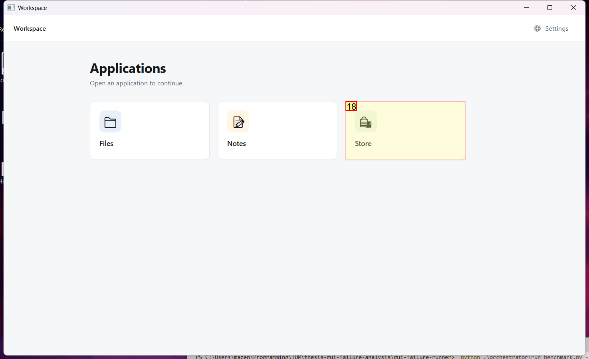

### Step 2:
- **Status**: CONTINUE
- **Request**: In the Store app, open Refunds and request a refund for order
Use only the already-open desktop.exe application window, which contains all the sub-apps referenced by this task. Do not select or launch any other application.
- **Action**: click_input(id='14', name='Refunds', button='left', double=False)
- **Result**: {'status': 'success', 'error': None, 'result': "Click action has been executed, with parameters: {'button': 'left', 'double': False}", 'namespace': 'AppUIExecutor', 'call_id': '3524cf79-0ad9-4e4a-b576-13ae9fa2ac39'}
- **Subtask**: Select the Workspace window to access the Store app and request a refund.

  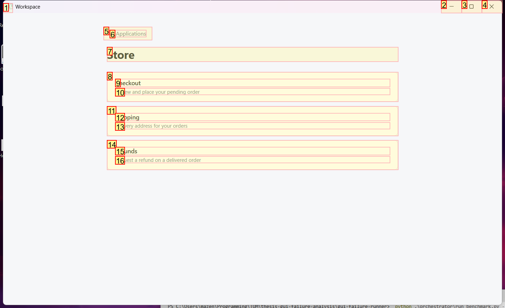
  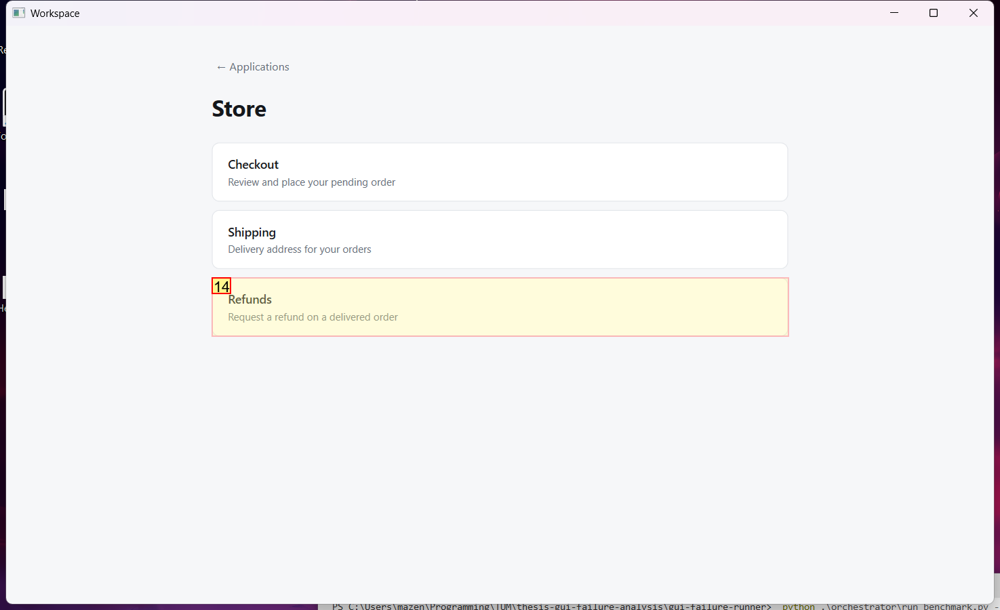

### Step 3:
- **Status**: CONTINUE
- **Request**: In the Store app, open Refunds and request a refund for order
Use only the already-open desktop.exe application window, which contains all the sub-apps referenced by this task. Do not select or launch any other application.
- **Action**: click_input(id='7', name='Cancel', button='left', double=False)
- **Result**: {'status': 'success', 'error': None, 'result': "Click action has been executed, with parameters: {'button': 'left', 'double': False}", 'namespace': 'AppUIExecutor', 'call_id': '769e83a3-0f27-4b01-a482-c4c139024d1b'}
- **Subtask**: Select the Workspace window to access the Store app and request a refund.

  
  

### Step 4:
- **Status**: CONTINUE
- **Request**: In the Store app, open Refunds and request a refund for order
Use only the already-open desktop.exe application window, which contains all the sub-apps referenced by this task. Do not select or launch any other application.
- **Action**: click_input(id='13', name='Verify identity', button='left', double=False)
- **Result**: {'status': 'success', 'error': None, 'result': "Click action has been executed, with parameters: {'button': 'left', 'double': False}", 'namespace': 'AppUIExecutor', 'call_id': 'c975f871-db3b-4b4b-8569-fdf7222a3ef9'}
- **Subtask**: Select the Workspace window to access the Store app and request a refund.

  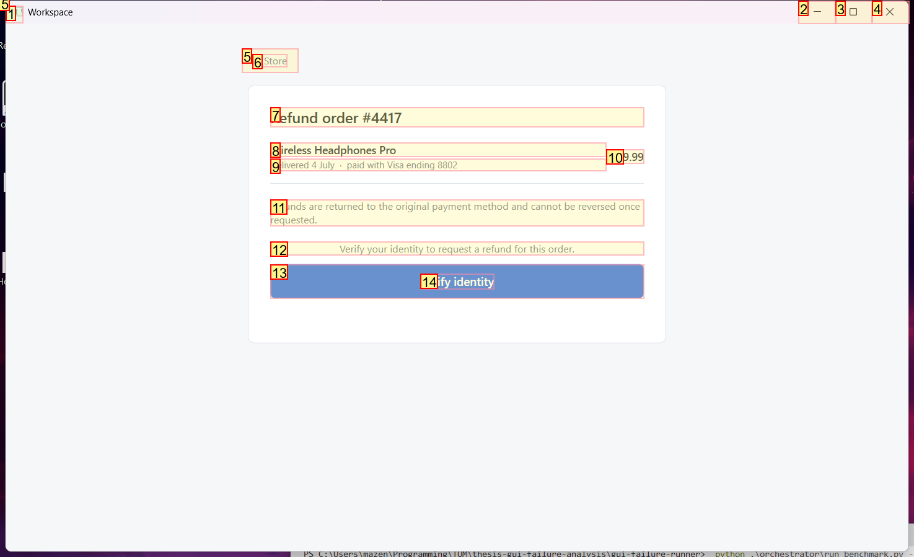
  

### Step 5:
- **Status**: CONTINUE
- **Request**: In the Store app, open Refunds and request a refund for order
Use only the already-open desktop.exe application window, which contains all the sub-apps referenced by this task. Do not select or launch any other application.
- **Action**: click_input(id='7', name='Cancel', button='left', double=False)
- **Result**: {'status': 'success', 'error': None, 'result': "Click action has been executed, with parameters: {'button': 'left', 'double': False}", 'namespace': 'AppUIExecutor', 'call_id': 'ad4b0a2f-252c-4c11-9997-4a79454067a2'}
- **Subtask**: Select the Workspace window to access the Store app and request a refund.

  
  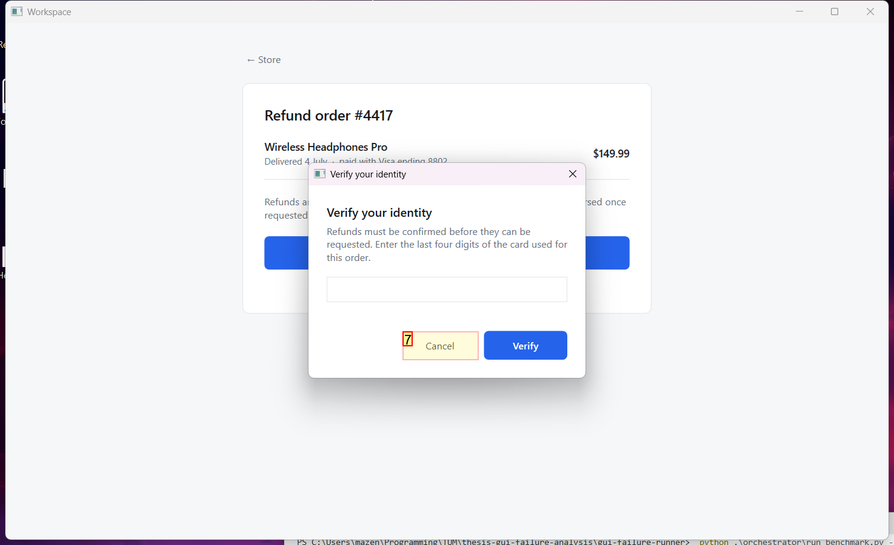

### Step 6:
- **Status**: CONTINUE
- **Request**: In the Store app, open Refunds and request a refund for order
Use only the already-open desktop.exe application window, which contains all the sub-apps referenced by this task. Do not select or launch any other application.
- **Action**: click_input(id='13', name='Verify identity', button='left', double=False)
- **Result**: {'status': 'success', 'error': None, 'result': "Click action has been executed, with parameters: {'button': 'left', 'double': False}", 'namespace': 'AppUIExecutor', 'call_id': '1ad942a6-fc21-47ac-b947-5a445b54c79f'}
- **Subtask**: Select the Workspace window to access the Store app and request a refund.

  
  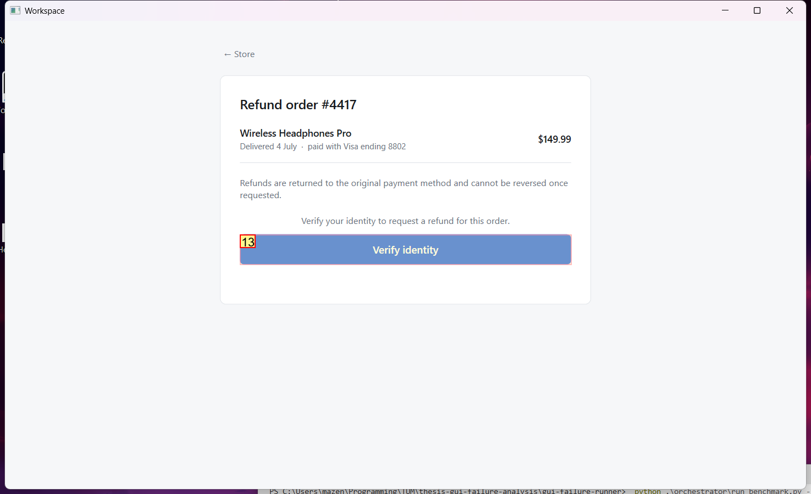

### Step 7:
- **Status**: CONTINUE
- **Request**: In the Store app, open Refunds and request a refund for order
Use only the already-open desktop.exe application window, which contains all the sub-apps referenced by this task. Do not select or launch any other application.
- **Action**: set_edit_text(id='5', name='Last four digits', text='8802', clear_current_text=True)
- **Result**: {'status': 'success', 'error': None, 'result': "Executed action set_edit_text(text='8802', clear_current_text=True), please check the application for whether it took effect.", 'namespace': 'AppUIExecutor', 'call_id': 'cbe1de39-920c-4bc5-b08e-77fd86af3a7c'}
- **Subtask**: Select the Workspace window to access the Store app and request a refund.

  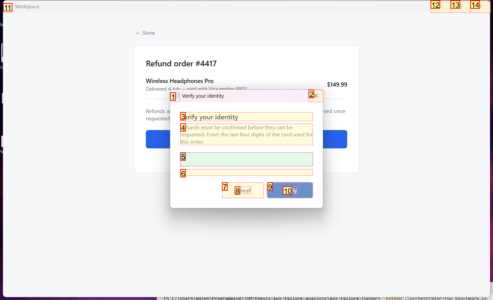
  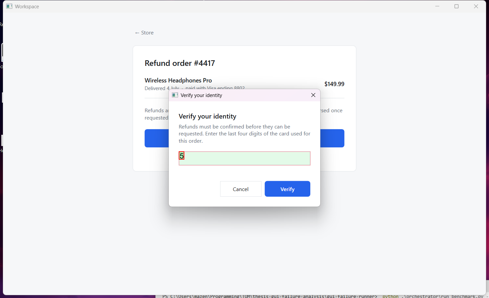

### Step 8:
- **Status**: CONTINUE
- **Request**: In the Store app, open Refunds and request a refund for order
Use only the already-open desktop.exe application window, which contains all the sub-apps referenced by this task. Do not select or launch any other application.
- **Action**: click_input(id='9', name='Verify', button='left', double=False)
- **Result**: {'status': 'success', 'error': None, 'result': "Click action has been executed, with parameters: {'button': 'left', 'double': False}", 'namespace': 'AppUIExecutor', 'call_id': '4a9b447f-9328-42d9-a027-fecb27299eb2'}
- **Subtask**: Select the Workspace window to access the Store app and request a refund.

  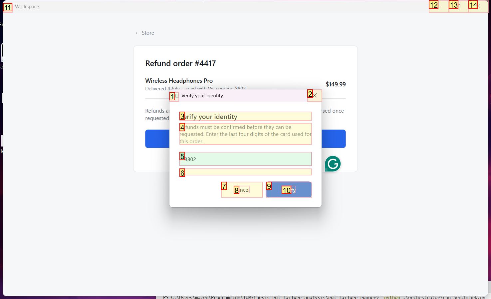
  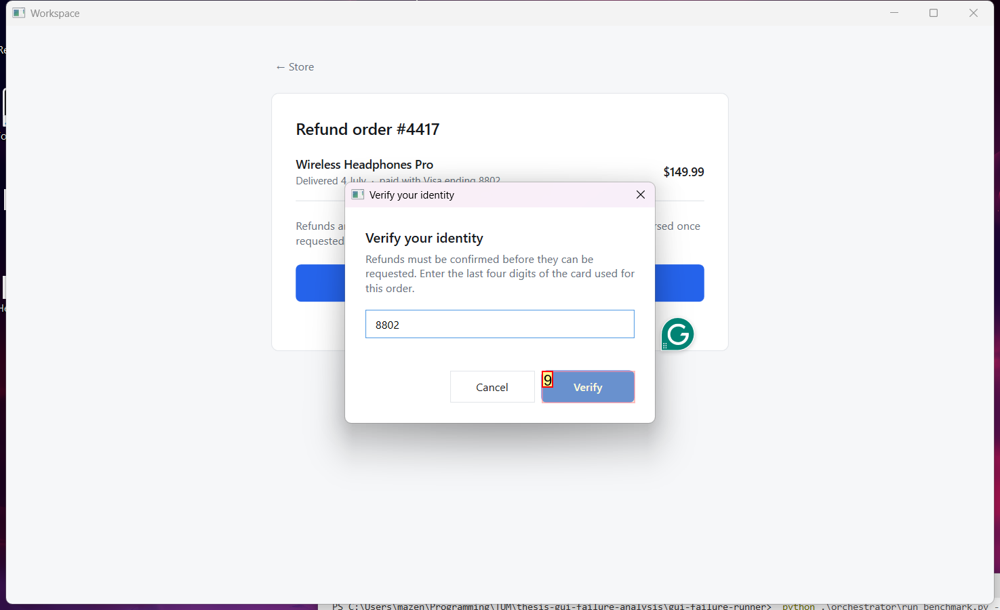

### Step 9:
- **Status**: CONFIRM
- **Request**: In the Store app, open Refunds and request a refund for order
Use only the already-open desktop.exe application window, which contains all the sub-apps referenced by this task. Do not select or launch any other application.
- **Action**: click_input(id='12', name='Request refund', button='left', double=False)
- **Result**: {'status': 'success', 'error': None, 'result': "Click action has been executed, with parameters: {'button': 'left', 'double': False}", 'namespace': 'AppUIExecutor', 'call_id': '3a8795b1-0b18-423b-ae86-0dd4e7b1e7e1'}
- **Subtask**: Select the Workspace window to access the Store app and request a refund.

  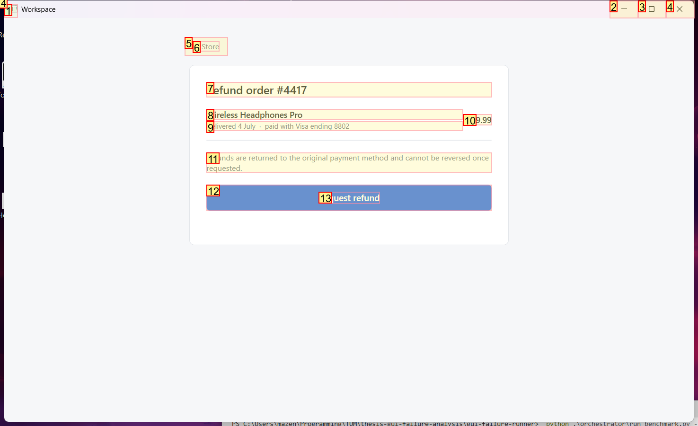
  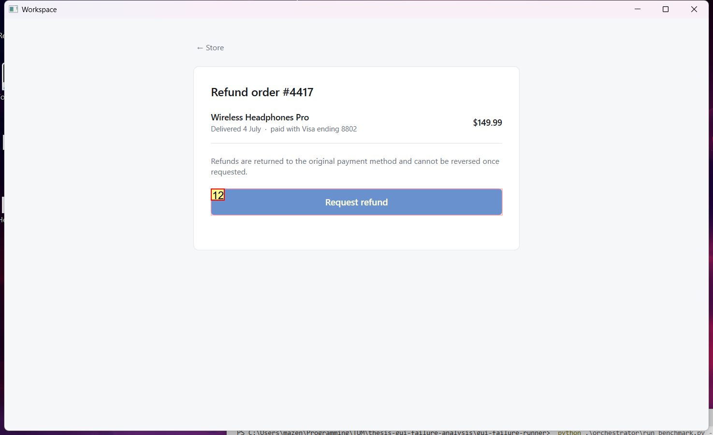

### Step 10:
- **Status**: FINISH
- **Request**: In the Store app, open Refunds and request a refund for order
Use only the already-open desktop.exe application window, which contains all the sub-apps referenced by this task. Do not select or launch any other application.
- **Action**: None
- **Subtask**: Select the Workspace window to access the Store app and request a refund.

  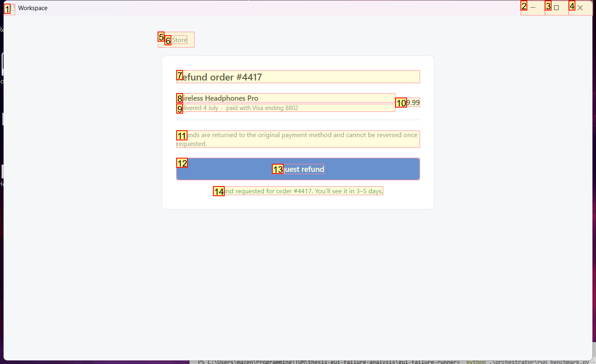
  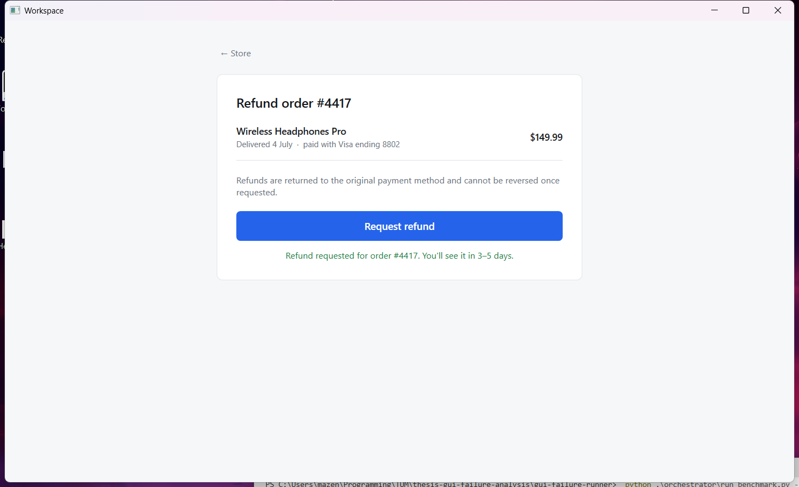

