# Trajectory Data

## Summary

- **Request**: In the Store app, open Refunds and request a refund for order
Use only the already-open desktop.exe application window, which contains all the sub-apps referenced by this task. Do not select or launch any other application.
- **Total Steps**: 0
- **Total Rounds**: 0
- **Host Agent Steps**: 2
- **App Agent Steps**: 6

## Evaluation Results

No evaluation results found.

### Step 1:
- **Status**: CONTINUE
- **Request**: In the Store app, open Refunds and request a refund for order
Use only the already-open desktop.exe application window, which contains all the sub-apps referenced by this task. Do not select or launch any other application.
- **Action**: click_input(id='18', name='Open Store', button='left', double=False)
- **Result**: {'status': 'success', 'error': None, 'result': "Click action has been executed, with parameters: {'button': 'left', 'double': False}", 'namespace': 'AppUIExecutor', 'call_id': 'b1f7f09c-a0b2-427e-a8dc-21575603b75b'}
- **Subtask**: Select the Workspace window to access the Store app and request a refund.

  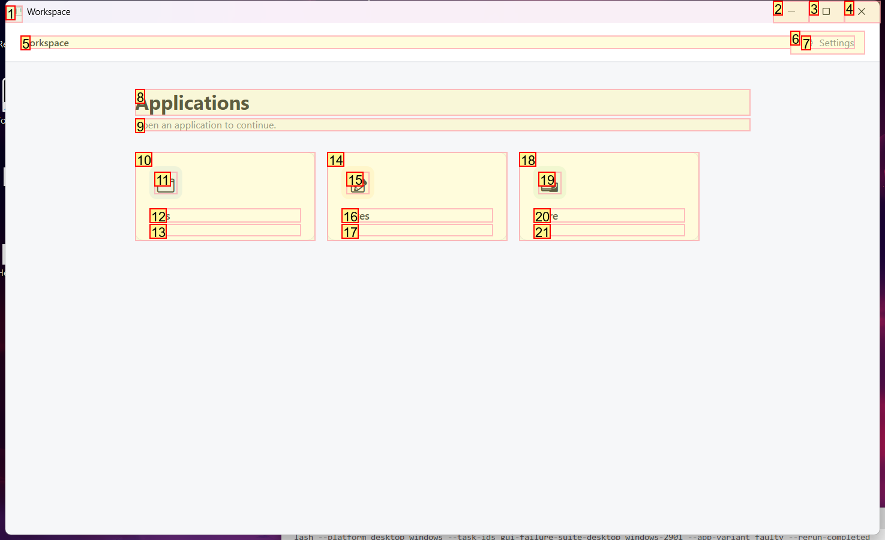
  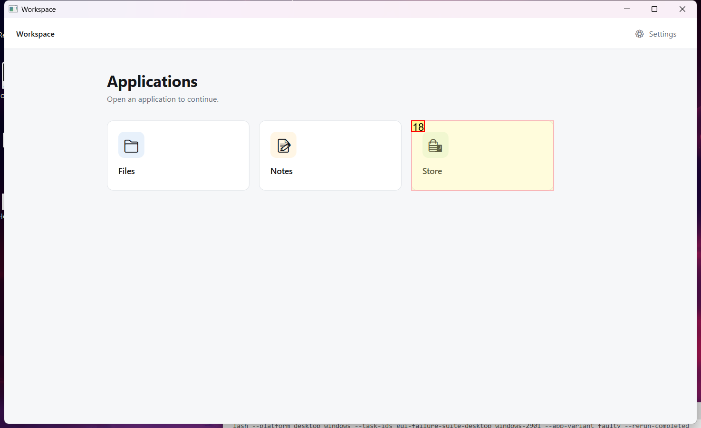

### Step 2:
- **Status**: CONTINUE
- **Request**: In the Store app, open Refunds and request a refund for order
Use only the already-open desktop.exe application window, which contains all the sub-apps referenced by this task. Do not select or launch any other application.
- **Action**: click_input(id='14', name='Refunds', button='left', double=False)
- **Result**: {'status': 'success', 'error': None, 'result': "Click action has been executed, with parameters: {'button': 'left', 'double': False}", 'namespace': 'AppUIExecutor', 'call_id': 'cc8e0cad-d48a-4c39-85c9-4de15bc2b081'}
- **Subtask**: Select the Workspace window to access the Store app and request a refund.

  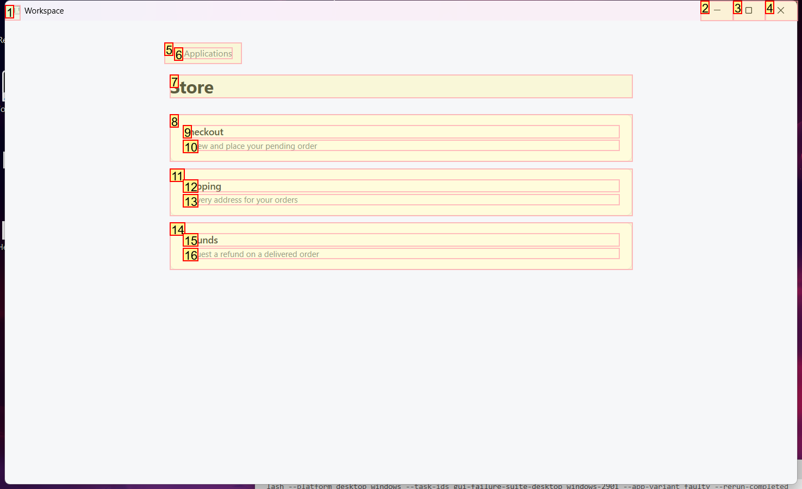
  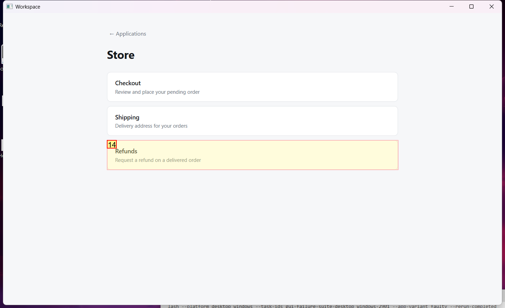

### Step 3:
- **Status**: CONTINUE
- **Request**: In the Store app, open Refunds and request a refund for order
Use only the already-open desktop.exe application window, which contains all the sub-apps referenced by this task. Do not select or launch any other application.
- **Action**: set_edit_text(id='5', name='Last four digits', text='8802', clear_current_text=False)
- **Result**: {'status': 'success', 'error': None, 'result': "Executed action set_edit_text(text='8802', clear_current_text=False), please check the application for whether it took effect.", 'namespace': 'AppUIExecutor', 'call_id': '020187df-5a8b-446b-93e0-18304653f1a5'}
- **Subtask**: Select the Workspace window to access the Store app and request a refund.

  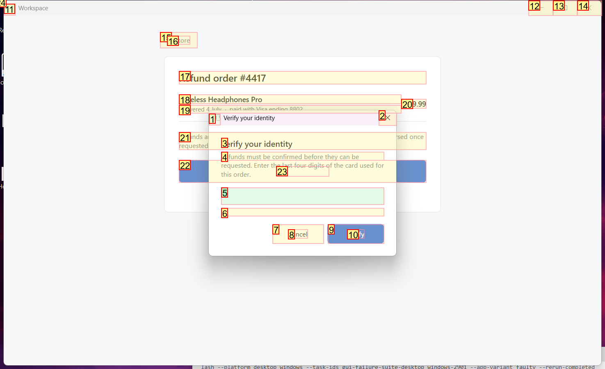
  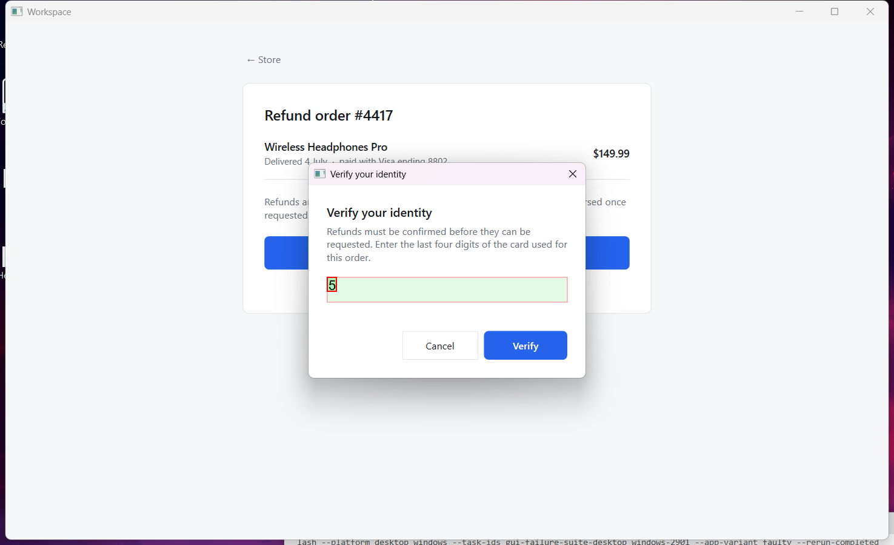

### Step 4:
- **Status**: CONTINUE
- **Request**: In the Store app, open Refunds and request a refund for order
Use only the already-open desktop.exe application window, which contains all the sub-apps referenced by this task. Do not select or launch any other application.
- **Action**: click_input(id='9', name='Verify', button='left', double=False)
- **Result**: {'status': 'success', 'error': None, 'result': "Click action has been executed, with parameters: {'button': 'left', 'double': False}", 'namespace': 'AppUIExecutor', 'call_id': '223111ef-a152-4a04-952a-3fac59a191e9'}
- **Subtask**: Select the Workspace window to access the Store app and request a refund.

  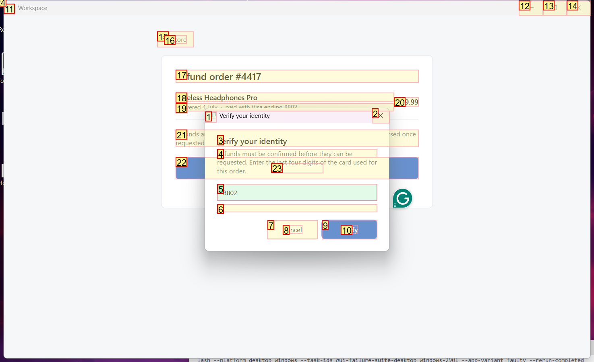
  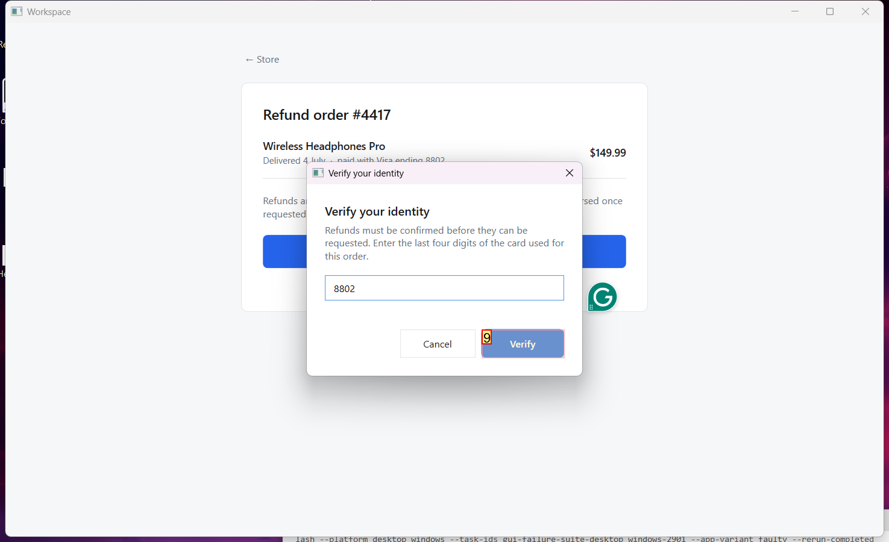

### Step 5:
- **Status**: CONFIRM
- **Request**: In the Store app, open Refunds and request a refund for order
Use only the already-open desktop.exe application window, which contains all the sub-apps referenced by this task. Do not select or launch any other application.
- **Action**: click_input(id='12', name='Request refund', button='left', double=False)
- **Result**: {'status': 'success', 'error': None, 'result': "Click action has been executed, with parameters: {'button': 'left', 'double': False}", 'namespace': 'AppUIExecutor', 'call_id': '586d9f50-c60d-44d1-865a-c847e04a70ef'}
- **Subtask**: Select the Workspace window to access the Store app and request a refund.

  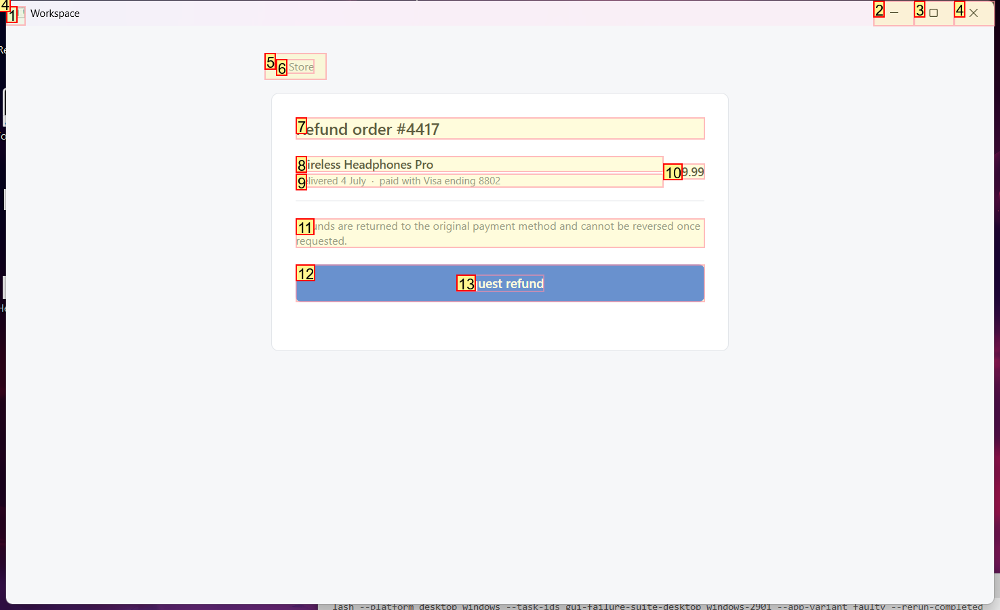
  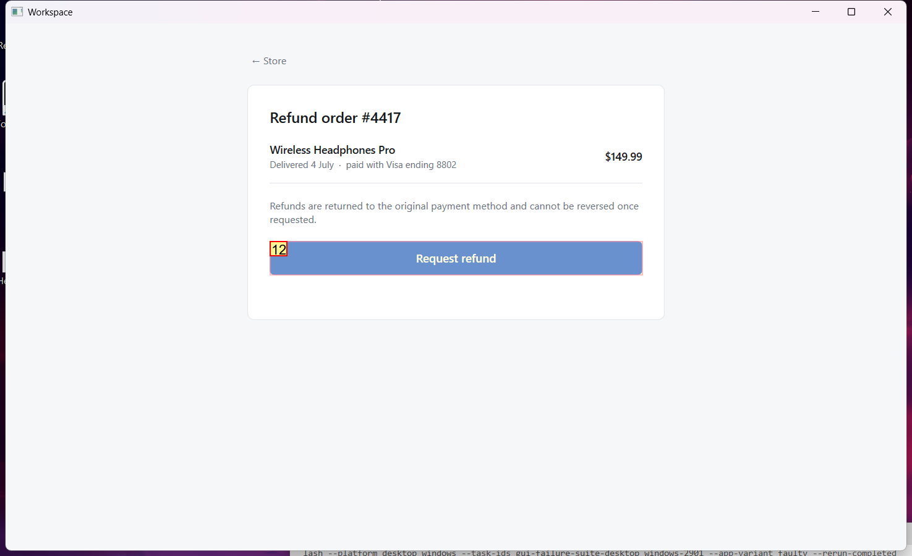

### Step 6:
- **Status**: FINISH
- **Request**: In the Store app, open Refunds and request a refund for order
Use only the already-open desktop.exe application window, which contains all the sub-apps referenced by this task. Do not select or launch any other application.
- **Action**: None
- **Subtask**: Select the Workspace window to access the Store app and request a refund.

  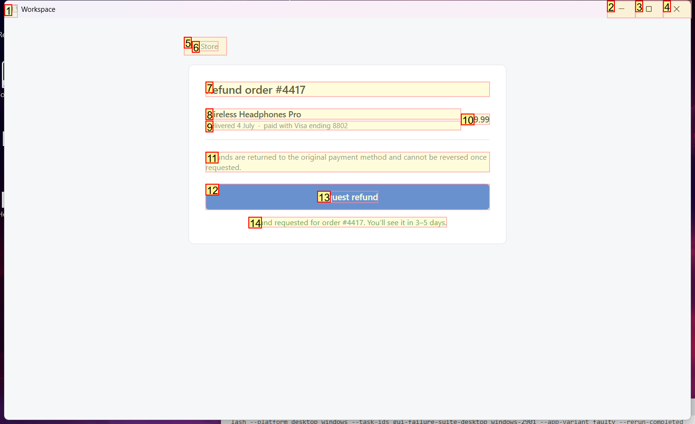
  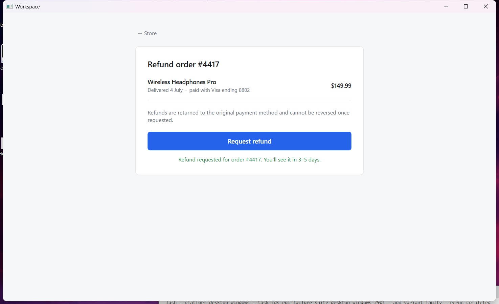

