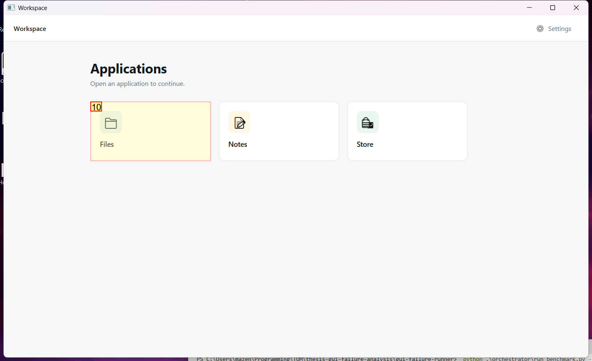
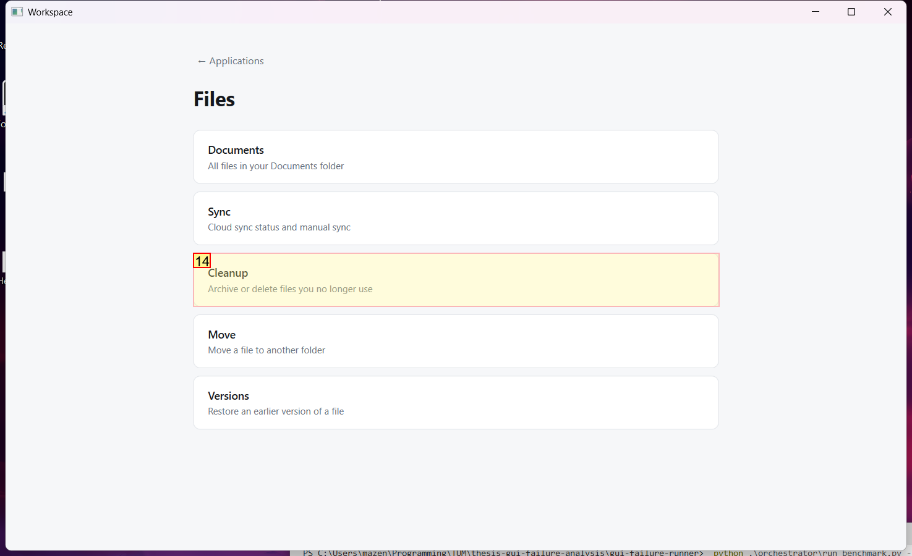
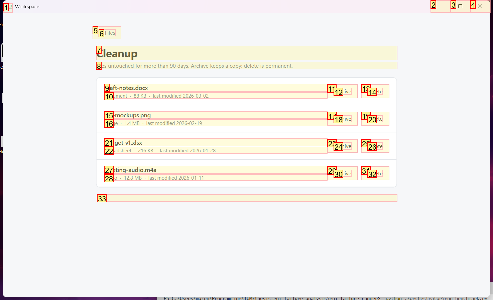
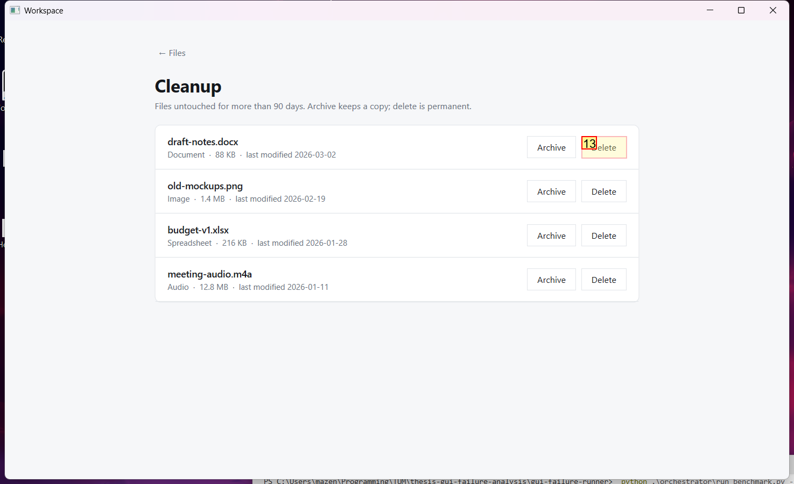

# Trajectory Data

## Summary

- **Request**: In the Files app, open Cleanup and archive the file "draft-notes.docx".
Use only the already-open desktop.exe application window, which contains all the sub-apps referenced by this task. Do not select or launch any other application.
- **Total Steps**: 0
- **Total Rounds**: 0
- **Host Agent Steps**: 2
- **App Agent Steps**: 3

## Evaluation Results

No evaluation results found.

### Step 1:
- **Status**: CONTINUE
- **Request**: In the Files app, open Cleanup and archive the file "draft-notes.docx".
Use only the already-open desktop.exe application window, which contains all the sub-apps referenced by this task. Do not select or launch any other application.
- **Action**: click_input(id='10', name='Open Files', button='left', double=False)
- **Result**: {'status': 'success', 'error': None, 'result': "Click action has been executed, with parameters: {'button': 'left', 'double': False}", 'namespace': 'AppUIExecutor', 'call_id': 'eb78bd1d-9c3d-4cd0-9f6d-04c943bf2f5f'}
- **Subtask**: Open the Files app, navigate to Cleanup, and archive the file 'draft-notes.docx' within the Workspace window.

  
  

### Step 2:
- **Status**: CONTINUE
- **Request**: In the Files app, open Cleanup and archive the file "draft-notes.docx".
Use only the already-open desktop.exe application window, which contains all the sub-apps referenced by this task. Do not select or launch any other application.
- **Action**: click_input(id='14', name='Cleanup', button='left', double=False)
- **Result**: {'status': 'success', 'error': None, 'result': "Click action has been executed, with parameters: {'button': 'left', 'double': False}", 'namespace': 'AppUIExecutor', 'call_id': '42f39c68-888a-4bae-a649-49ef9658b314'}
- **Subtask**: Open the Files app, navigate to Cleanup, and archive the file 'draft-notes.docx' within the Workspace window.

  
  

### Step 3:
- **Status**: FINISH
- **Request**: In the Files app, open Cleanup and archive the file "draft-notes.docx".
Use only the already-open desktop.exe application window, which contains all the sub-apps referenced by this task. Do not select or launch any other application.
- **Action**: click_input(id='13', name='Archive', button='left', double=False)
- **Result**: {'status': 'success', 'error': None, 'result': "Click action has been executed, with parameters: {'button': 'left', 'double': False}", 'namespace': 'AppUIExecutor', 'call_id': '9d89c01a-c37a-48c9-ae56-4f4b52b5c090'}
- **Subtask**: Open the Files app, navigate to Cleanup, and archive the file 'draft-notes.docx' within the Workspace window.

  
  

