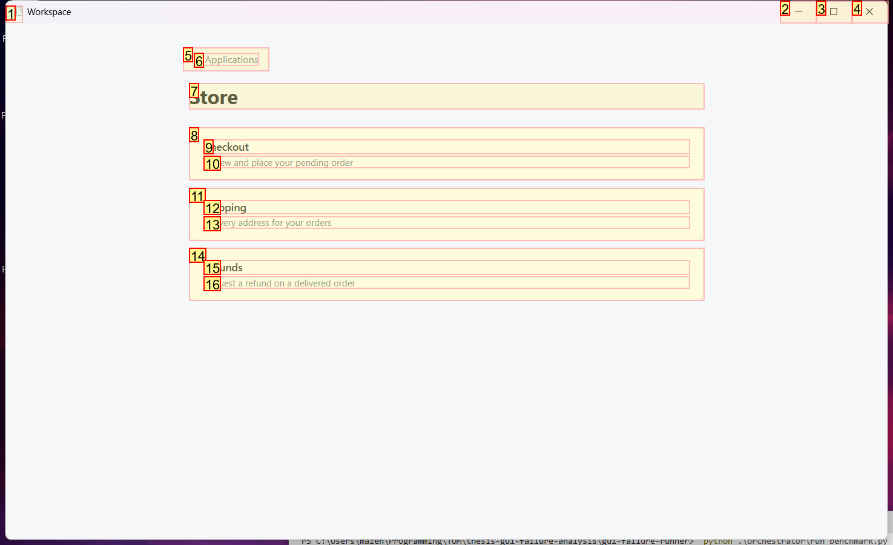
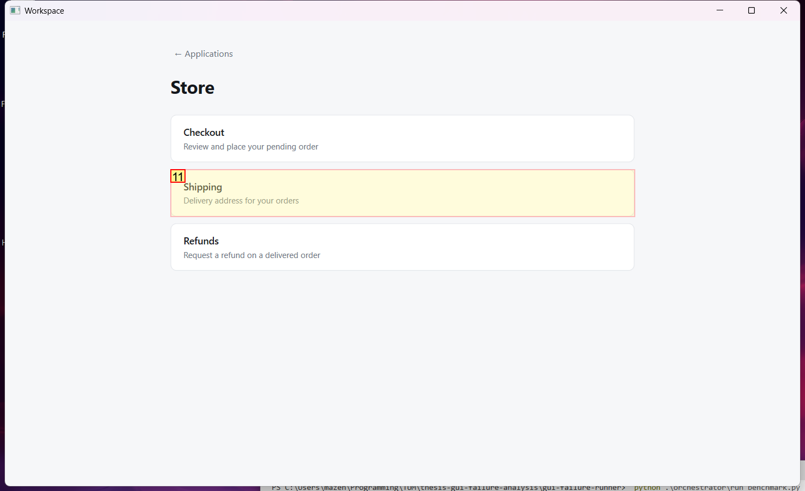
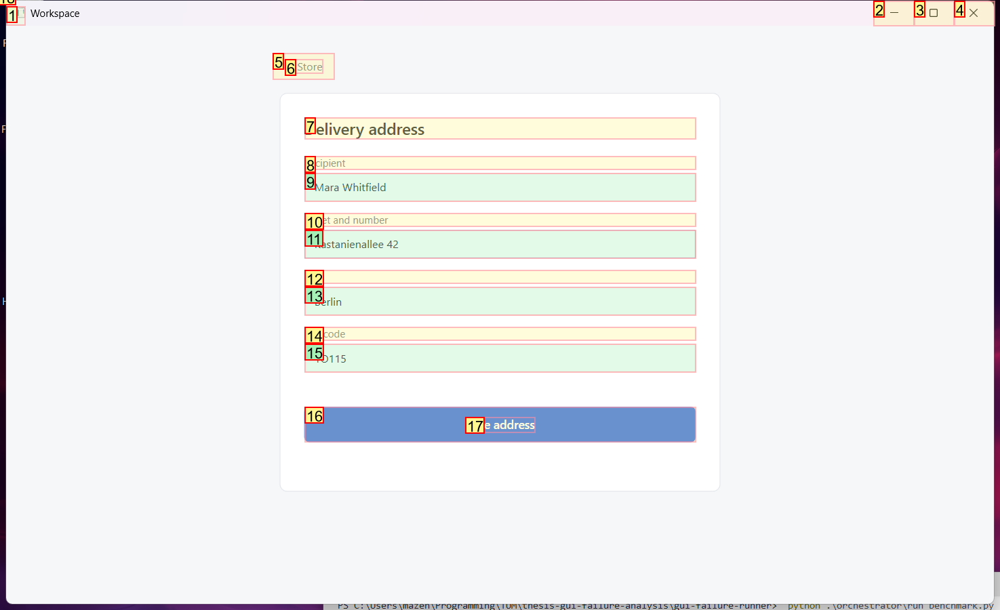
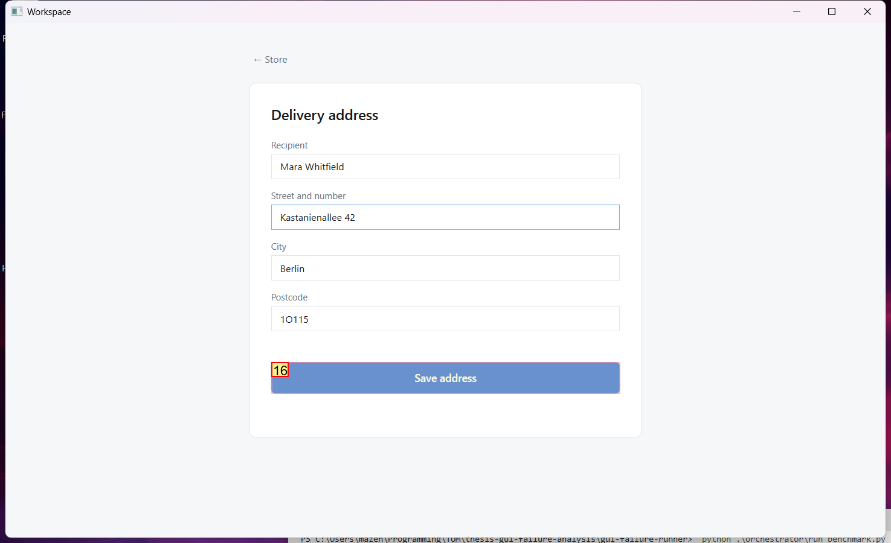

# Trajectory Data

## Summary

- **Request**: In the Store app, open Shipping and save the delivery address.
Use only the already-open desktop.exe application window, which contains all the sub-apps referenced by this task. Do not select or launch any other application.
- **Total Steps**: 0
- **Total Rounds**: 0
- **Host Agent Steps**: 2
- **App Agent Steps**: 3

## Evaluation Results

No evaluation results found.

### Step 1:
- **Status**: CONTINUE
- **Request**: In the Store app, open Shipping and save the delivery address.
Use only the already-open desktop.exe application window, which contains all the sub-apps referenced by this task. Do not select or launch any other application.
- **Action**: click_input(id='18', name='Open Store', button='left', double=False)
- **Result**: {'status': 'success', 'error': None, 'result': "Click action has been executed, with parameters: {'button': 'left', 'double': False}", 'namespace': 'AppUIExecutor', 'call_id': '1a60f5e0-c47c-41f1-a6ae-2bd006980f39'}
- **Subtask**: Select the Workspace window to access the Store app and Shipping settings.

  
  

### Step 2:
- **Status**: CONTINUE
- **Request**: In the Store app, open Shipping and save the delivery address.
Use only the already-open desktop.exe application window, which contains all the sub-apps referenced by this task. Do not select or launch any other application.
- **Action**: click_input(id='11', name='Shipping', button='left', double=False)
- **Result**: {'status': 'success', 'error': None, 'result': "Click action has been executed, with parameters: {'button': 'left', 'double': False}", 'namespace': 'AppUIExecutor', 'call_id': 'e99828c4-c63c-42b3-a27e-8676d9539726'}
- **Subtask**: Select the Workspace window to access the Store app and Shipping settings.

  
  

### Step 3:
- **Status**: FINISH
- **Request**: In the Store app, open Shipping and save the delivery address.
Use only the already-open desktop.exe application window, which contains all the sub-apps referenced by this task. Do not select or launch any other application.
- **Action**: click_input(id='16', name='Save address', button='left', double=False)
- **Result**: {'status': 'success', 'error': None, 'result': "Click action has been executed, with parameters: {'button': 'left', 'double': False}", 'namespace': 'AppUIExecutor', 'call_id': 'a4326edd-73de-49f4-a687-10937c603aed'}
- **Subtask**: Select the Workspace window to access the Store app and Shipping settings.

  
  

