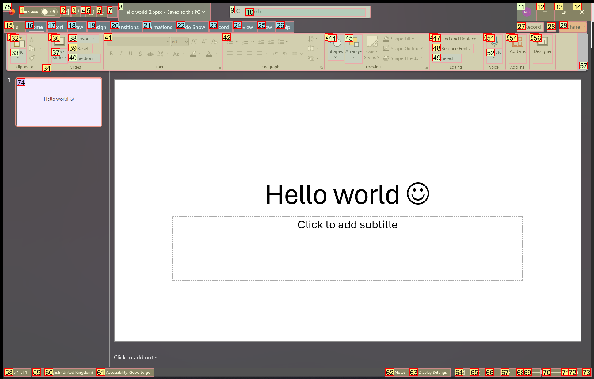
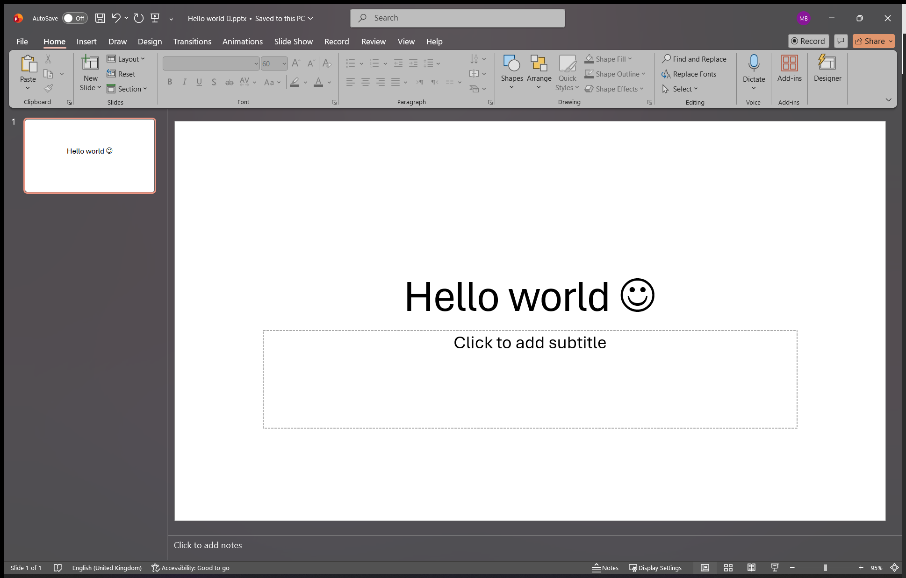

# Trajectory Data

## Summary

- **Request**: Could you help me export the PowerPoint file to a .png image file and save it as res.png at the same position as the file? 
- **Total Steps**: 0
- **Total Rounds**: 0
- **Host Agent Steps**: 6
- **App Agent Steps**: 2

## Evaluation Results

No evaluation results found.

### Step 1:
- **Status**: FINISH
- **Request**: Could you help me export the PowerPoint file to a .png image file and save it as res.png at the same position as the file? 
- **Action**: save_as(file_name='res', file_ext='.png', current_slide_only=True)
- **Result**: {'status': 'success', 'error': None, 'result': 'Document is saved to C:\\Users\\mazen\\OneDrive\\Desktop\\res.png.', 'namespace': 'PowerPointCOMExecutor', 'call_id': '75bce5f0-0745-4ad4-ab49-882c9028e889'}
- **Subtask**: Export the 'Hello world 😉.pptx' presentation to a .png image file named 'res.png' and save it in the same directory as the original file.

  
  

### Step 1:
- **Status**: FINISH
- **Request**: Could you help me export the PowerPoint file to a .png image file and save it as res.png at the same position as the file? 
- **Action**: save_as(file_name='res', file_ext='.png', current_slide_only=True)
- **Result**: {'status': 'success', 'error': None, 'result': 'Document is saved to C:\\Users\\mazen\\OneDrive\\Desktop\\res.png.', 'namespace': 'PowerPointCOMExecutor', 'call_id': 'fbb1966a-3237-4691-9ac6-8db3a577130c'}
- **Subtask**: Export the PowerPoint file to a .png image file named 'res.png' in the same directory.

  
  

