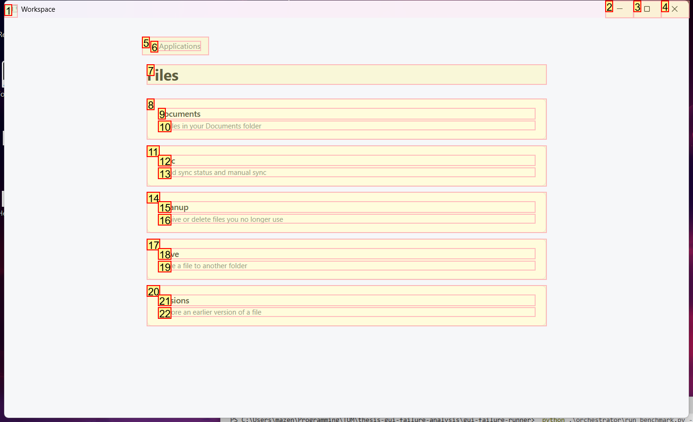
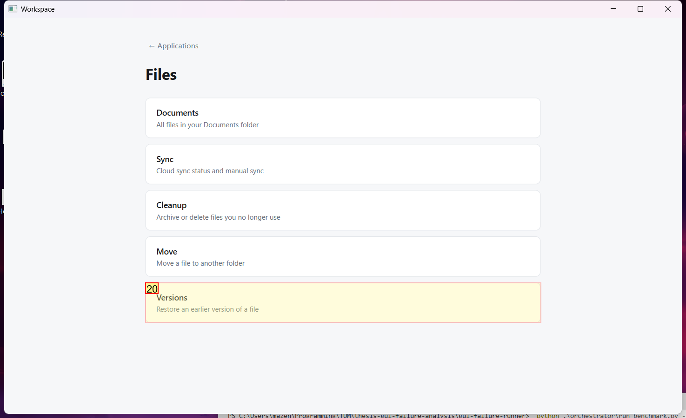
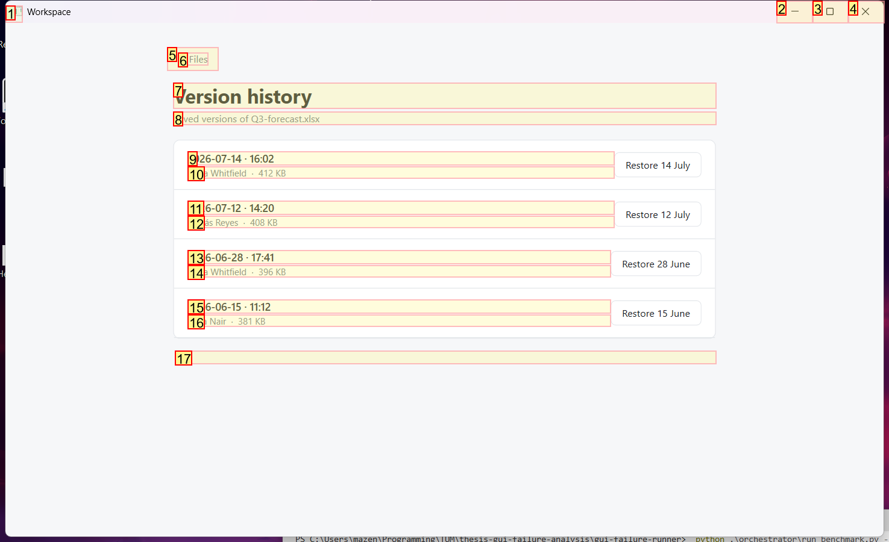
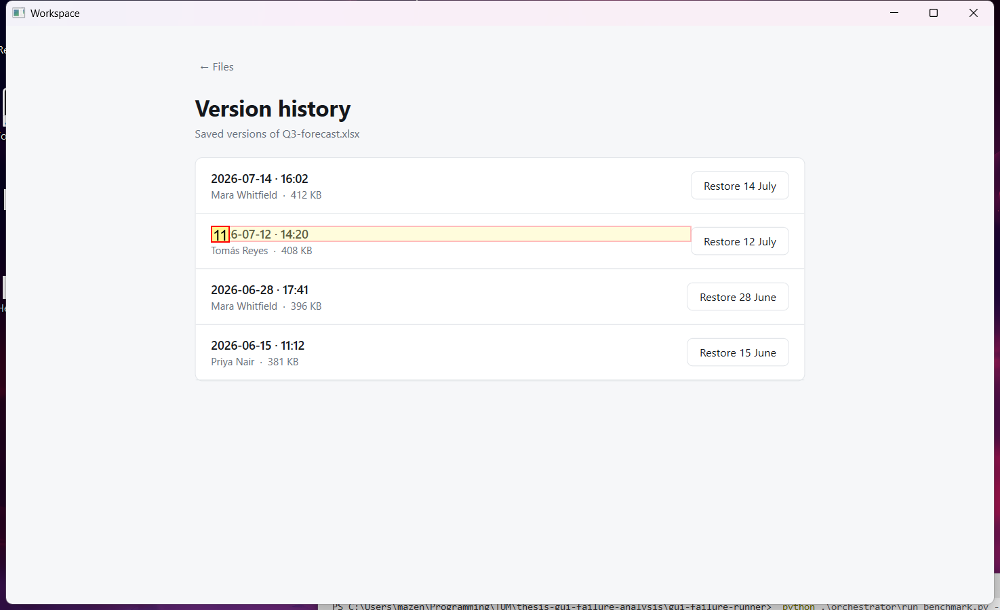

# Trajectory Data

## Summary

- **Request**: In the Files app, open Versions and restore the version from 12 July.
Use only the already-open desktop.exe application window, which contains all the sub-apps referenced by this task. Do not select or launch any other application.
- **Total Steps**: 0
- **Total Rounds**: 0
- **Host Agent Steps**: 1
- **App Agent Steps**: 3

## Evaluation Results

No evaluation results found.

### Step 1:
- **Status**: CONTINUE
- **Request**: In the Files app, open Versions and restore the version from 12 July.
Use only the already-open desktop.exe application window, which contains all the sub-apps referenced by this task. Do not select or launch any other application.
- **Action**: click_input(id='10', name='Open Files', button='left', double=False)
- **Result**: {'status': 'success', 'error': None, 'result': "Click action has been executed, with parameters: {'button': 'left', 'double': False}", 'namespace': 'AppUIExecutor', 'call_id': 'c3bf2b41-0bd5-4754-8690-d081adb78f82'}
- **Subtask**: Select the Workspace application window to access the Files app and restore the version from 12 July.

  
  

### Step 2:
- **Status**: CONTINUE
- **Request**: In the Files app, open Versions and restore the version from 12 July.
Use only the already-open desktop.exe application window, which contains all the sub-apps referenced by this task. Do not select or launch any other application.
- **Action**: click_input(id='20', name='Versions', button='left', double=False)
- **Result**: {'status': 'success', 'error': None, 'result': "Click action has been executed, with parameters: {'button': 'left', 'double': False}", 'namespace': 'AppUIExecutor', 'call_id': 'eb015bed-6f46-41cd-a5a0-74f59e7606a8'}
- **Subtask**: Select the Workspace application window to access the Files app and restore the version from 12 July.

  
  

### Step 3:
- **Status**: CONTINUE
- **Request**: In the Files app, open Versions and restore the version from 12 July.
Use only the already-open desktop.exe application window, which contains all the sub-apps referenced by this task. Do not select or launch any other application.
- **Action**: click_input(id='11', name='2026-07-12 · 14:20', button='left', double=False)
- **Result**: {'status': 'success', 'error': None, 'result': "Click action has been executed, with parameters: {'button': 'left', 'double': False}", 'namespace': 'AppUIExecutor', 'call_id': '4e80a5d1-aacf-4278-8811-58afc7ae3592'}
- **Subtask**: Select the Workspace application window to access the Files app and restore the version from 12 July.

  
  

