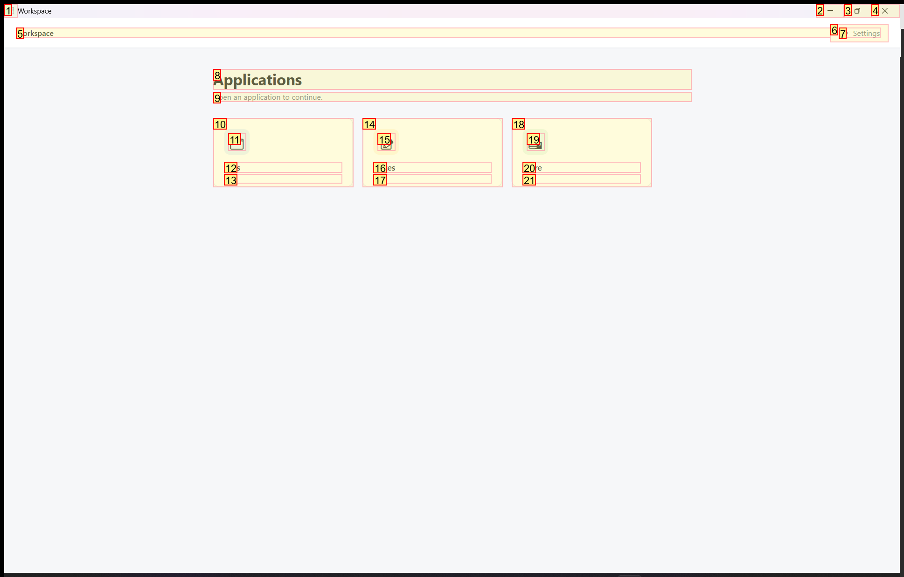
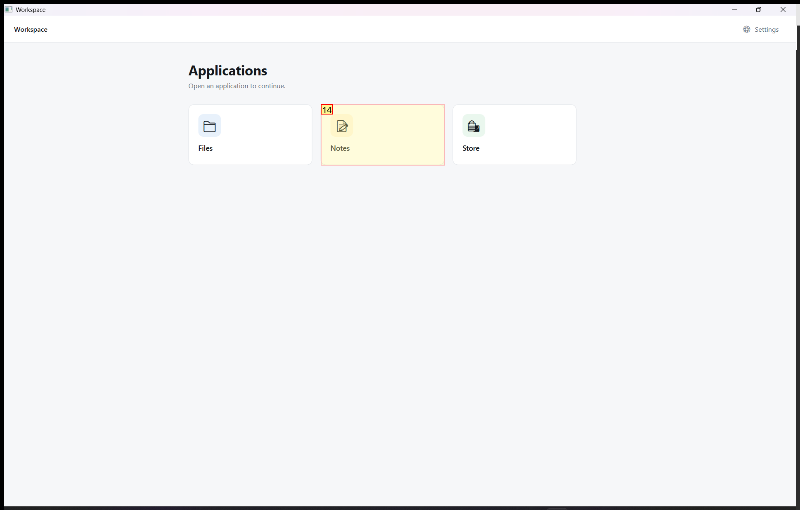
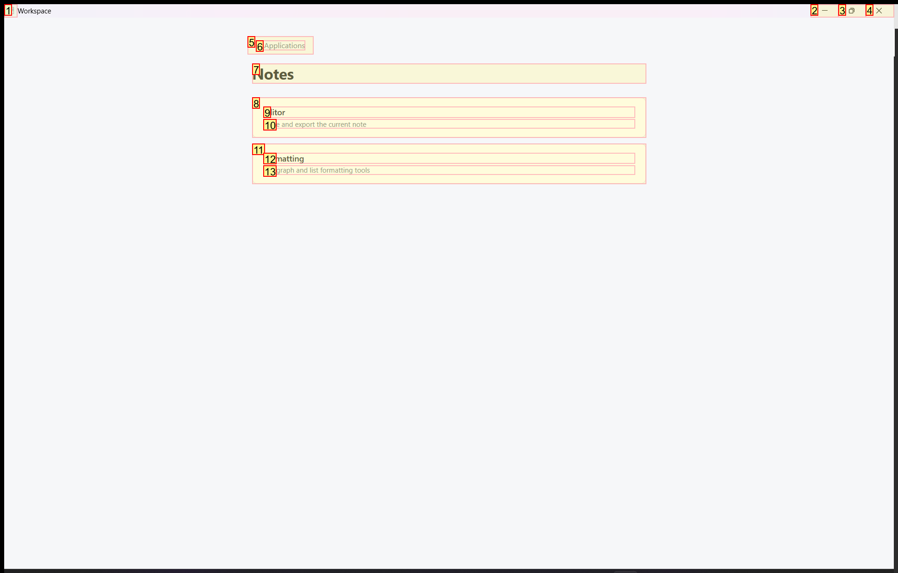
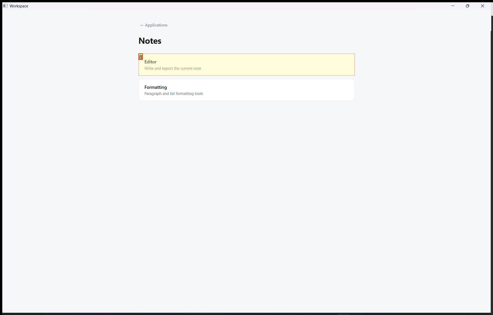
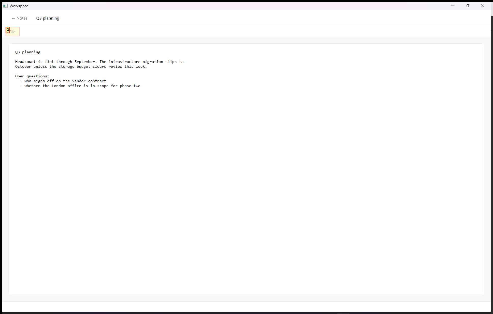
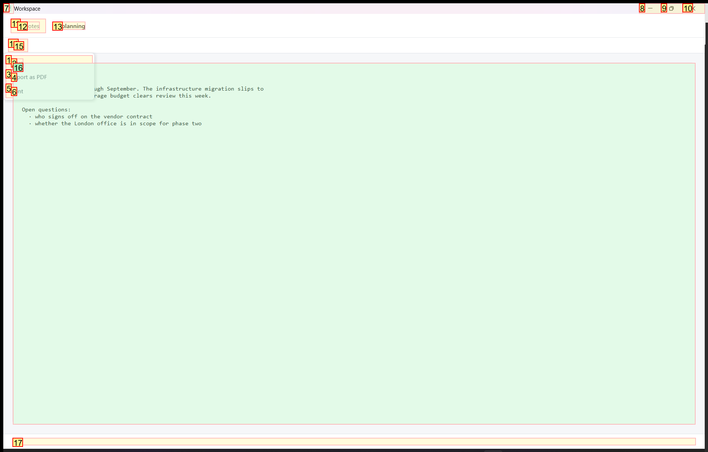
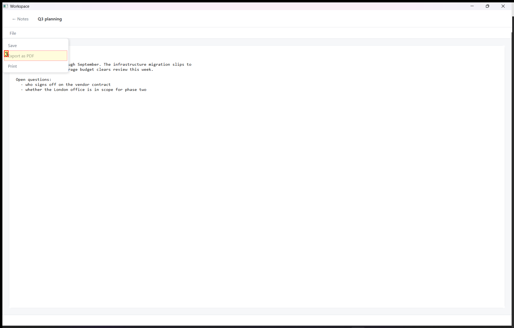
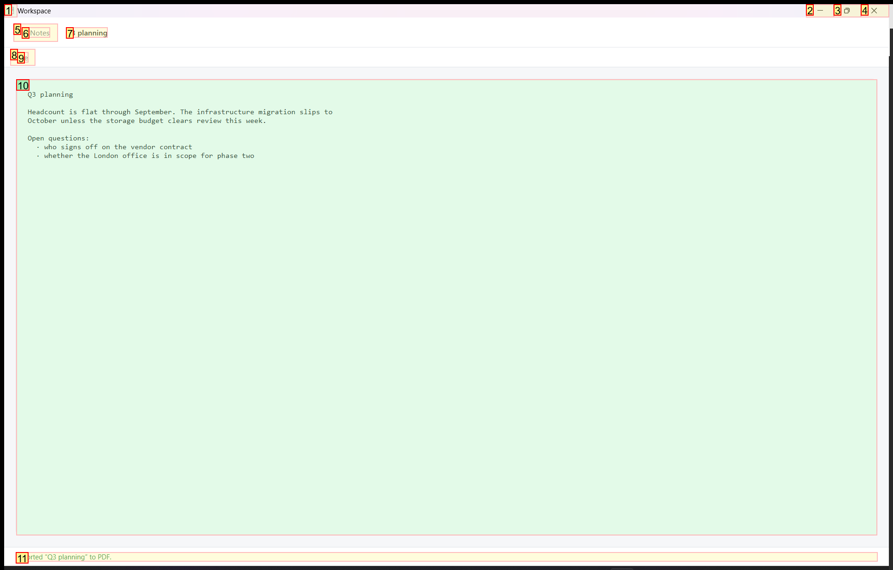
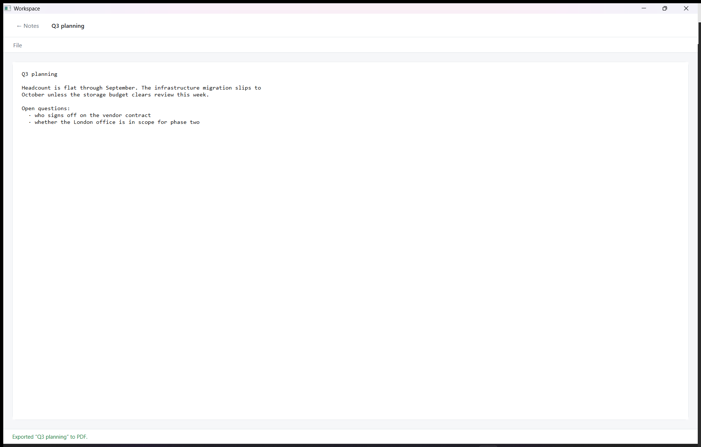

# Trajectory Data

## Summary

- **Request**: In the Notes app, open the Editor and export the note as a PDF.
Use only the already-open desktop.exe application window, which contains all the sub-apps referenced by this task. Do not select or launch any other application.
- **Total Steps**: 0
- **Total Rounds**: 0
- **Host Agent Steps**: 3
- **App Agent Steps**: 5

## Evaluation Results

No evaluation results found.

### Step 1:
- **Status**: CONTINUE
- **Request**: In the Notes app, open the Editor and export the note as a PDF.
Use only the already-open desktop.exe application window, which contains all the sub-apps referenced by this task. Do not select or launch any other application.
- **Action**: click_input(id='14', name='Open Notes', button='left', double=False)
- **Result**: {'status': 'success', 'error': None, 'result': "Click action has been executed, with parameters: {'button': 'left', 'double': False}", 'namespace': 'AppUIExecutor', 'call_id': 'e1b2eb41-0f5c-410d-b556-91ede8927444'}
- **Subtask**: Open the Notes app within the Workspace window, access the Editor, and export the note as a PDF.

  
  

### Step 2:
- **Status**: CONTINUE
- **Request**: In the Notes app, open the Editor and export the note as a PDF.
Use only the already-open desktop.exe application window, which contains all the sub-apps referenced by this task. Do not select or launch any other application.
- **Action**: click_input(id='8', name='Editor', button='left', double=False)
- **Result**: {'status': 'success', 'error': None, 'result': "Click action has been executed, with parameters: {'button': 'left', 'double': False}", 'namespace': 'AppUIExecutor', 'call_id': '65a9ef41-a937-4b53-99ed-b68caa11f336'}
- **Subtask**: Open the Notes app within the Workspace window, access the Editor, and export the note as a PDF.

  
  

### Step 3:
- **Status**: CONTINUE
- **Request**: In the Notes app, open the Editor and export the note as a PDF.
Use only the already-open desktop.exe application window, which contains all the sub-apps referenced by this task. Do not select or launch any other application.
- **Action**: click_input(id='8', name='File', button='left', double=False)
- **Result**: {'status': 'success', 'error': None, 'result': "Click action has been executed, with parameters: {'button': 'left', 'double': False}", 'namespace': 'AppUIExecutor', 'call_id': 'c1181f0c-b54d-444d-aef1-bff4c4c8129c'}
- **Subtask**: Open the Notes app within the Workspace window, access the Editor, and export the note as a PDF.

  
  

### Step 4:
- **Status**: FINISH
- **Request**: In the Notes app, open the Editor and export the note as a PDF.
Use only the already-open desktop.exe application window, which contains all the sub-apps referenced by this task. Do not select or launch any other application.
- **Action**: click_input(id='3', name='Export as PDF', button='left', double=False)
- **Result**: {'status': 'success', 'error': None, 'result': "Click action has been executed, with parameters: {'button': 'left', 'double': False}", 'namespace': 'AppUIExecutor', 'call_id': '247d5aeb-2006-445d-88aa-b35770497195'}
- **Subtask**: Open the Notes app within the Workspace window, access the Editor, and export the note as a PDF.

  
  

### Step 6:
- **Status**: FINISH
- **Request**: In the Notes app, open the Editor and export the note as a PDF.
Use only the already-open desktop.exe application window, which contains all the sub-apps referenced by this task. Do not select or launch any other application.
- **Action**: summary(text="The note 'Q3 planning' has been successfully exported to PDF, as confirmed by the on-screen notification 'Exported “Q3 planning” to PDF.' No further action is required.")
- **Result**: {'status': 'success', 'error': None, 'result': "The note 'Q3 planning' has been successfully exported to PDF, as confirmed by the on-screen notification 'Exported “Q3 planning” to PDF.' No further action is required.", 'namespace': 'AppUIExecutor', 'call_id': 'dc89c512-148d-4295-b2ce-f5a29351c75f'}
- **Subtask**: Complete the PDF export process by handling any save dialogs or confirmation prompts in the Workspace window.

  
  

