# Trajectory Data

## Summary

- **Request**: In the Files app, open Documents and open the file "Q3-forecast.xlsx".
Use only the already-open desktop.exe application window, which contains all the sub-apps referenced by this task. Do not select or launch any other application.
- **Total Steps**: 0
- **Total Rounds**: 0
- **Host Agent Steps**: 2
- **App Agent Steps**: 15

## Evaluation Results

No evaluation results found.

### Step 1:
- **Status**: FINISH
- **Request**: In the Files app, open Documents and open the file "Q3-forecast.xlsx".
Use only the already-open desktop.exe application window, which contains all the sub-apps referenced by this task. Do not select or launch any other application.
- **Action**: click_input(id='10', name='Open Files', button='left', double=False)
- **Result**: {'status': 'success', 'error': None, 'result': "Click action has been executed, with parameters: {'button': 'left', 'double': False}", 'namespace': 'AppUIExecutor', 'call_id': '4a5eb0d5-448e-4b4b-a5e8-4428d84ee8a4'}
- **Subtask**: Select the Workspace window to access the simulated desktop environment and open the Files app.

  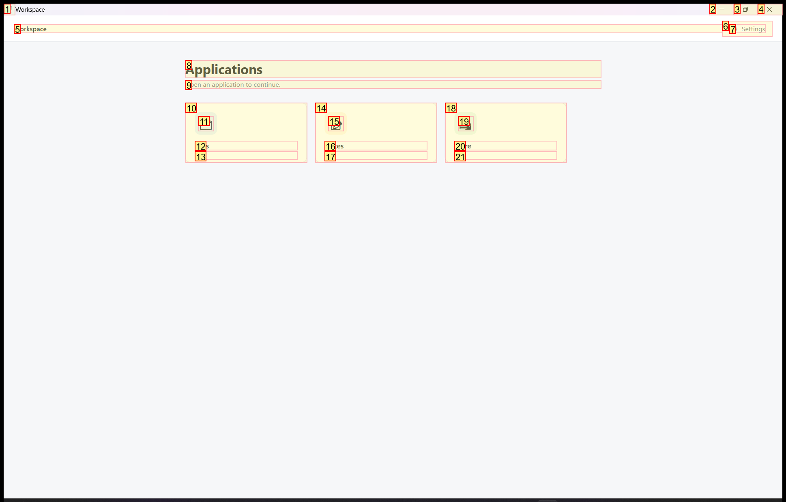
  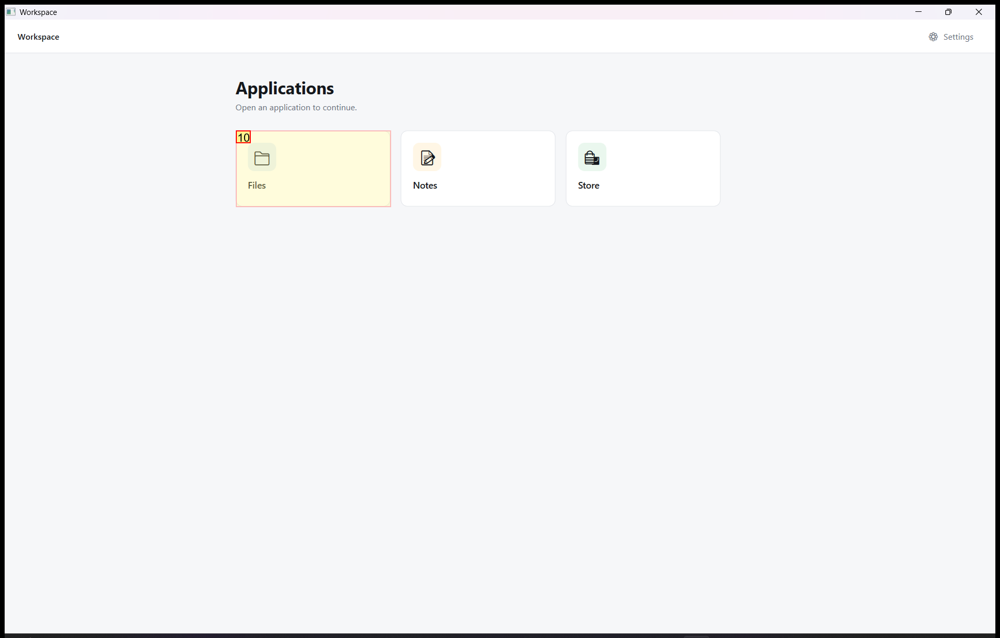

### Step 3:
- **Status**: CONTINUE
- **Request**: In the Files app, open Documents and open the file "Q3-forecast.xlsx".
Use only the already-open desktop.exe application window, which contains all the sub-apps referenced by this task. Do not select or launch any other application.
- **Action**: click_input(id='8', name='Documents', button='left', double=False)
- **Result**: {'status': 'success', 'error': None, 'result': "Click action has been executed, with parameters: {'button': 'left', 'double': False}", 'namespace': 'AppUIExecutor', 'call_id': '807e7e37-0827-4964-8ae9-3d532c786394'}
- **Subtask**: Navigate to the Documents folder and open 'Q3-forecast.xlsx' inside the Files app within the Workspace window.

  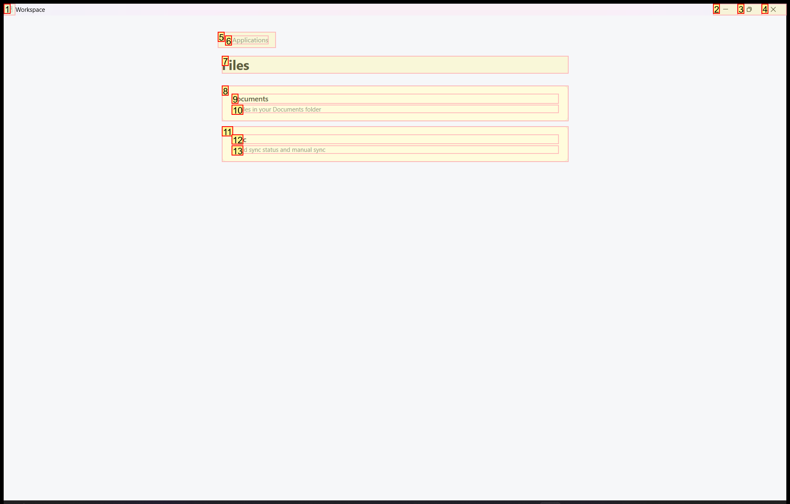
  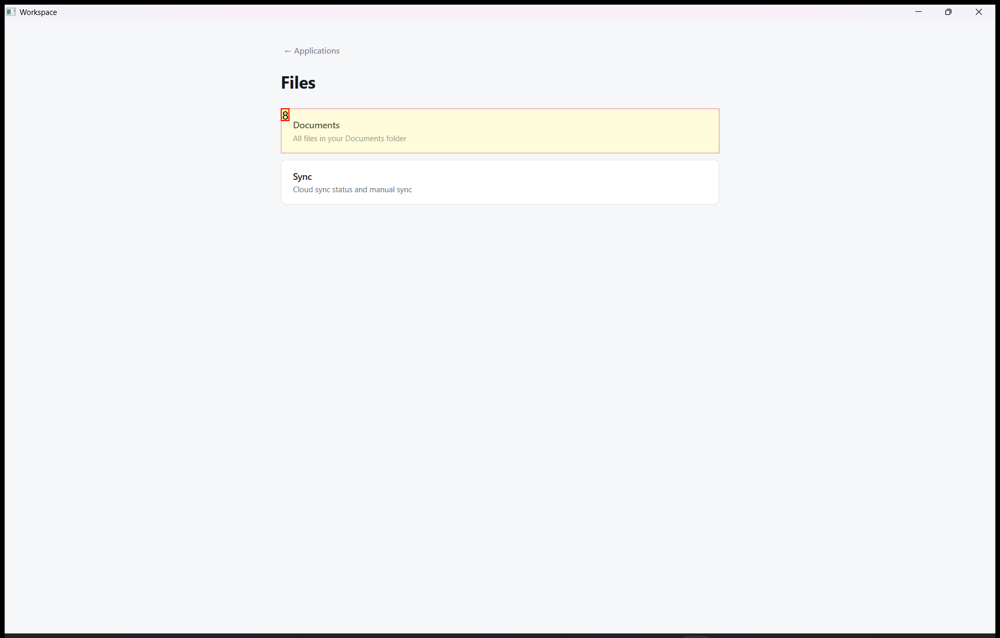

### Step 4:
- **Status**: CONTINUE
- **Request**: In the Files app, open Documents and open the file "Q3-forecast.xlsx".
Use only the already-open desktop.exe application window, which contains all the sub-apps referenced by this task. Do not select or launch any other application.
- **Action**: wheel_mouse_input(id='139', name='report-026.docx', wheel_dist=-10)
- **Result**: {'status': 'success', 'error': None, 'result': 'The wheel mouse input action has been executed on the selected control.', 'namespace': 'AppUIExecutor', 'call_id': 'cbc3d69b-2f58-4f01-b128-d17f6b64d5dc'}
- **Subtask**: Navigate to the Documents folder and open 'Q3-forecast.xlsx' inside the Files app within the Workspace window.

  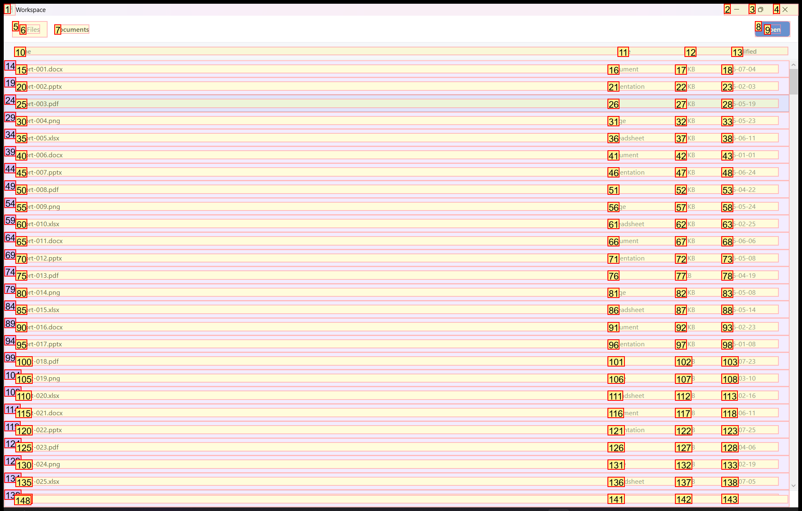
  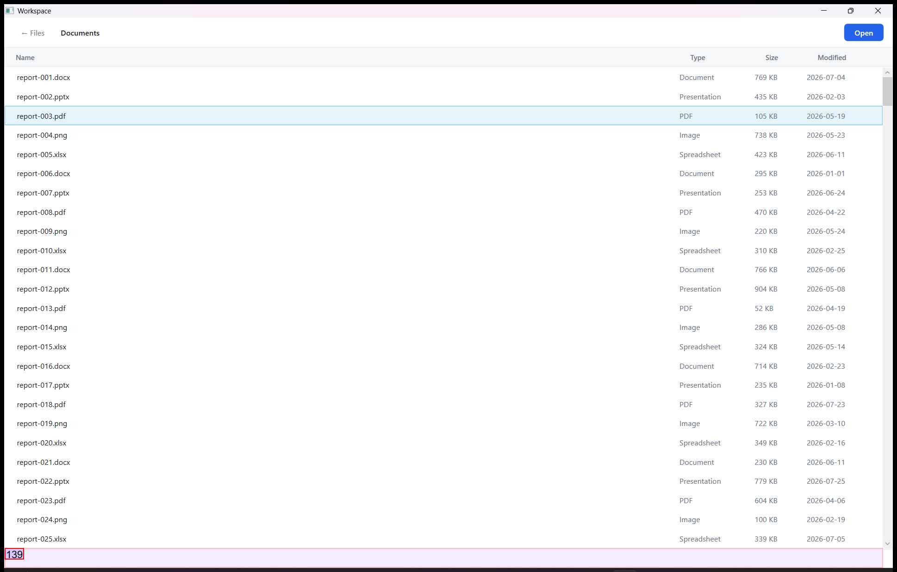

### Step 5:
- **Status**: CONTINUE
- **Request**: In the Files app, open Documents and open the file "Q3-forecast.xlsx".
Use only the already-open desktop.exe application window, which contains all the sub-apps referenced by this task. Do not select or launch any other application.
- **Action**: wheel_mouse_input(id='18', name='report-002.pptx', wheel_dist=20)
- **Result**: {'status': 'success', 'error': None, 'result': 'The wheel mouse input action has been executed on the selected control.', 'namespace': 'AppUIExecutor', 'call_id': 'e9bba1f8-0029-4640-aab0-db0fe3400f7a'}
- **Subtask**: Navigate to the Documents folder and open 'Q3-forecast.xlsx' inside the Files app within the Workspace window.

  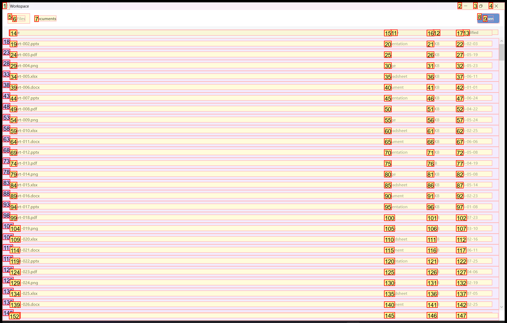
  

### Step 6:
- **Status**: CONTINUE
- **Request**: In the Files app, open Documents and open the file "Q3-forecast.xlsx".
Use only the already-open desktop.exe application window, which contains all the sub-apps referenced by this task. Do not select or launch any other application.
- **Action**: wheel_mouse_input(id='14', name='report-001.docx', wheel_dist=30)
- **Result**: {'status': 'success', 'error': None, 'result': 'The wheel mouse input action has been executed on the selected control.', 'namespace': 'AppUIExecutor', 'call_id': '83ea0948-31ff-4bb9-93b1-a0bfde50fac0'}
- **Subtask**: Navigate to the Documents folder and open 'Q3-forecast.xlsx' inside the Files app within the Workspace window.

  
  

### Step 7:
- **Status**: CONTINUE
- **Request**: In the Files app, open Documents and open the file "Q3-forecast.xlsx".
Use only the already-open desktop.exe application window, which contains all the sub-apps referenced by this task. Do not select or launch any other application.
- **Action**: wheel_mouse_input(id='139', name='report-026.docx', wheel_dist=-30)
- **Result**: {'status': 'success', 'error': None, 'result': 'The wheel mouse input action has been executed on the selected control.', 'namespace': 'AppUIExecutor', 'call_id': '925def50-ade8-4058-bbdf-35e4d270dce1'}
- **Subtask**: Navigate to the Documents folder and open 'Q3-forecast.xlsx' inside the Files app within the Workspace window.

  
  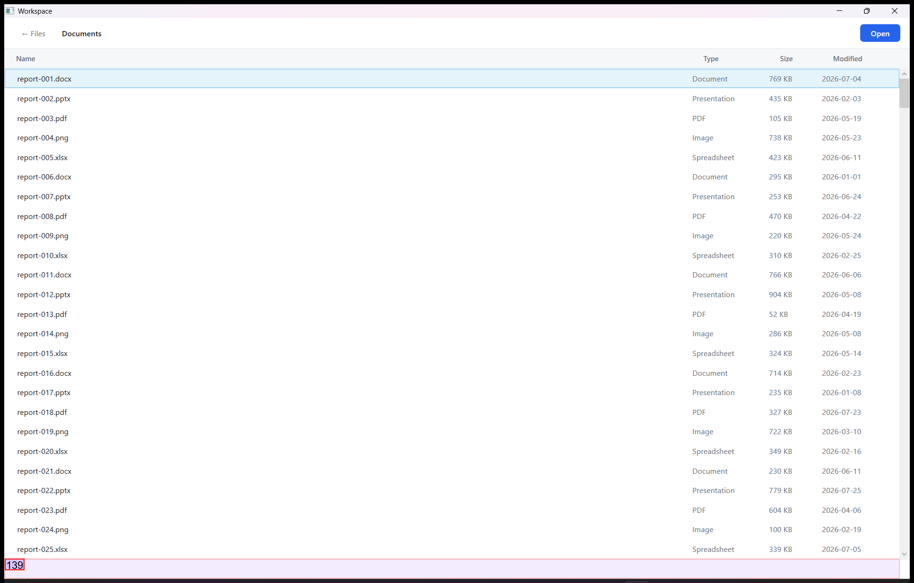

### Step 8:
- **Status**: CONTINUE
- **Request**: In the Files app, open Documents and open the file "Q3-forecast.xlsx".
Use only the already-open desktop.exe application window, which contains all the sub-apps referenced by this task. Do not select or launch any other application.
- **Action**: wheel_mouse_input(id='143', name='report-027.pptx', wheel_dist=-50)
- **Result**: {'status': 'success', 'error': None, 'result': 'The wheel mouse input action has been executed on the selected control.', 'namespace': 'AppUIExecutor', 'call_id': 'c43f2522-3ebb-4919-ad8e-b347e542c204'}
- **Subtask**: Navigate to the Documents folder and open 'Q3-forecast.xlsx' inside the Files app within the Workspace window.

  
  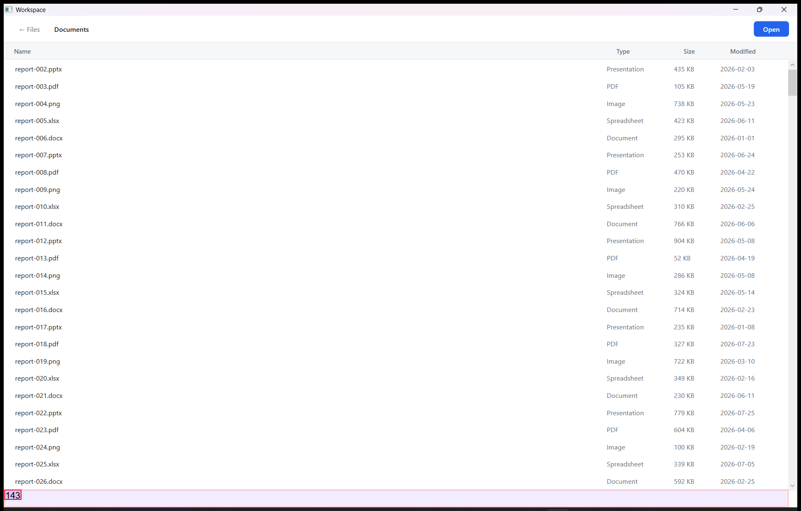

### Step 9:
- **Status**: CONTINUE
- **Request**: In the Files app, open Documents and open the file "Q3-forecast.xlsx".
Use only the already-open desktop.exe application window, which contains all the sub-apps referenced by this task. Do not select or launch any other application.
- **Action**: wheel_mouse_input(id='18', name='report-003.pdf', wheel_dist=100)
- **Result**: {'status': 'success', 'error': None, 'result': 'The wheel mouse input action has been executed on the selected control.', 'namespace': 'AppUIExecutor', 'call_id': '3f8aff0a-aa48-436f-8384-74fe904f34a3'}
- **Subtask**: Navigate to the Documents folder and open 'Q3-forecast.xlsx' inside the Files app within the Workspace window.

  
  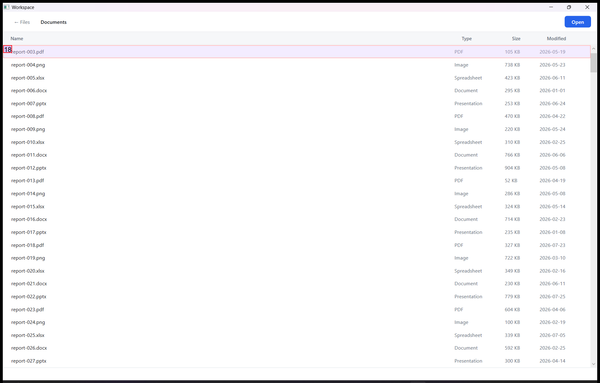

### Step 10:
- **Status**: CONTINUE
- **Request**: In the Files app, open Documents and open the file "Q3-forecast.xlsx".
Use only the already-open desktop.exe application window, which contains all the sub-apps referenced by this task. Do not select or launch any other application.
- **Action**: wheel_mouse_input(id='14', name='report-001.docx', wheel_dist=100)
- **Result**: {'status': 'success', 'error': None, 'result': 'The wheel mouse input action has been executed on the selected control.', 'namespace': 'AppUIExecutor', 'call_id': 'fe8fac6c-4617-420d-ba67-6e8e98cb7fcb'}
- **Subtask**: Navigate to the Documents folder and open 'Q3-forecast.xlsx' inside the Files app within the Workspace window.

  
  

### Step 11:
- **Status**: CONTINUE
- **Request**: In the Files app, open Documents and open the file "Q3-forecast.xlsx".
Use only the already-open desktop.exe application window, which contains all the sub-apps referenced by this task. Do not select or launch any other application.
- **Action**: wheel_mouse_input(id='14', name='report-001.docx', wheel_dist=-100)
- **Result**: {'status': 'success', 'error': None, 'result': 'The wheel mouse input action has been executed on the selected control.', 'namespace': 'AppUIExecutor', 'call_id': 'e3881e49-6f4d-4d2a-a8ff-99b4a73f5143'}
- **Subtask**: Navigate to the Documents folder and open 'Q3-forecast.xlsx' inside the Files app within the Workspace window.

  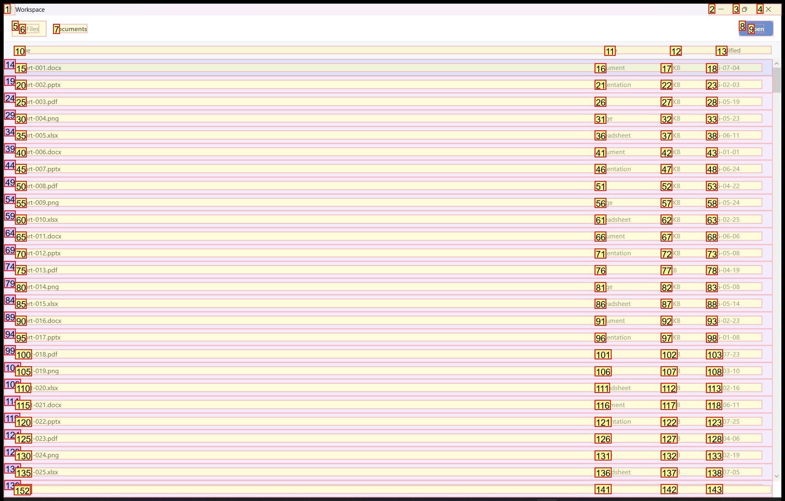
  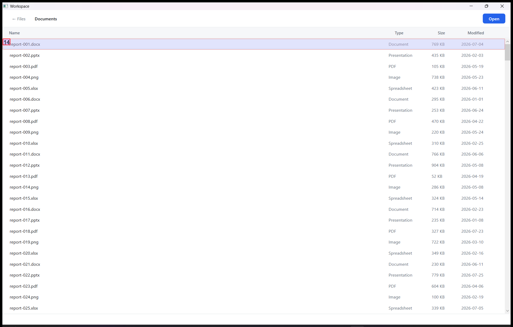

### Step 12:
- **Status**: CONTINUE
- **Request**: In the Files app, open Documents and open the file "Q3-forecast.xlsx".
Use only the already-open desktop.exe application window, which contains all the sub-apps referenced by this task. Do not select or launch any other application.
- **Action**: wheel_mouse_input(id='152', name='report-030.xlsx', wheel_dist=-100)
- **Result**: {'status': 'success', 'error': None, 'result': 'The wheel mouse input action has been executed on the selected control.', 'namespace': 'AppUIExecutor', 'call_id': 'ebdf7a08-d0c2-4958-82e2-6f5818f067bd'}
- **Subtask**: Navigate to the Documents folder and open 'Q3-forecast.xlsx' inside the Files app within the Workspace window.

  
  

### Step 13:
- **Status**: CONTINUE
- **Request**: In the Files app, open Documents and open the file "Q3-forecast.xlsx".
Use only the already-open desktop.exe application window, which contains all the sub-apps referenced by this task. Do not select or launch any other application.
- **Action**: wheel_mouse_input(id='14', name='report-001.docx', wheel_dist=100)
- **Result**: {'status': 'success', 'error': None, 'result': 'The wheel mouse input action has been executed on the selected control.', 'namespace': 'AppUIExecutor', 'call_id': '28a6d490-01ff-46e7-b68a-ba488a77df96'}
- **Subtask**: Navigate to the Documents folder and open 'Q3-forecast.xlsx' inside the Files app within the Workspace window.

  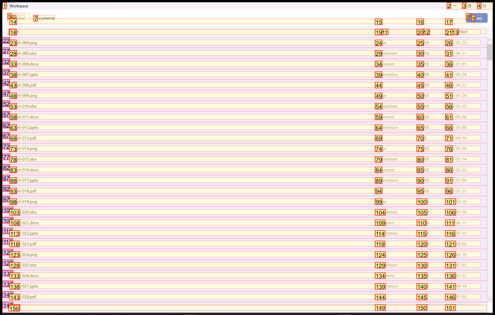
  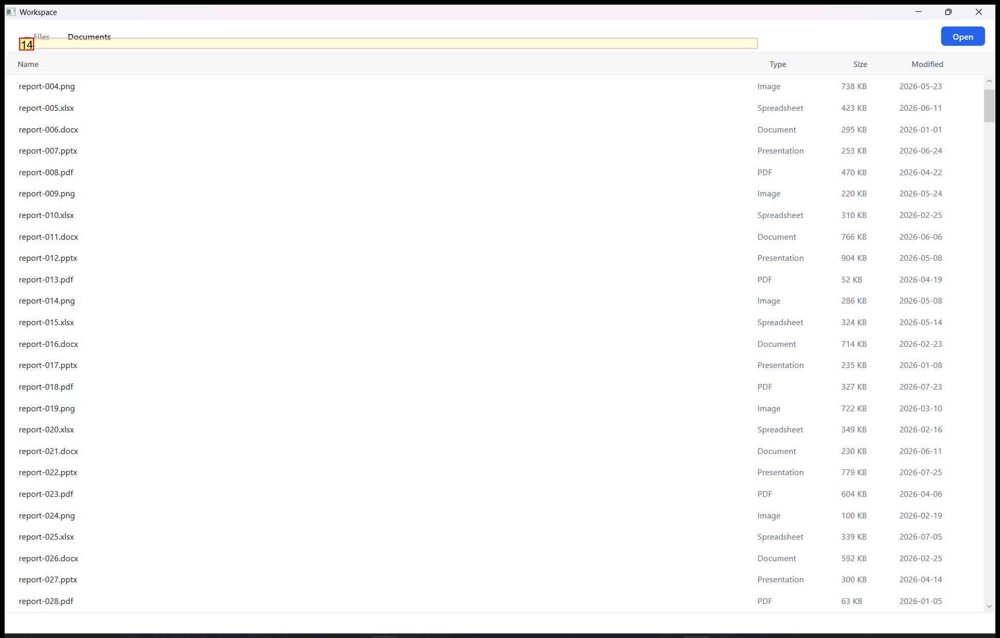

### Step 14:
- **Status**: CONTINUE
- **Request**: In the Files app, open Documents and open the file "Q3-forecast.xlsx".
Use only the already-open desktop.exe application window, which contains all the sub-apps referenced by this task. Do not select or launch any other application.
- **Action**: wheel_mouse_input(id='152', name='report-030.xlsx', wheel_dist=-100)
- **Result**: {'status': 'success', 'error': None, 'result': 'The wheel mouse input action has been executed on the selected control.', 'namespace': 'AppUIExecutor', 'call_id': 'e5763804-979a-44ed-aee8-a15c9821946c'}
- **Subtask**: Navigate to the Documents folder and open 'Q3-forecast.xlsx' inside the Files app within the Workspace window.

  
  

### Step 15:
- **Status**: CONTINUE
- **Request**: In the Files app, open Documents and open the file "Q3-forecast.xlsx".
Use only the already-open desktop.exe application window, which contains all the sub-apps referenced by this task. Do not select or launch any other application.
- **Action**: wheel_mouse_input(id='152', name='report-030.xlsx', wheel_dist=-100)
- **Result**: {'status': 'success', 'error': None, 'result': 'The wheel mouse input action has been executed on the selected control.', 'namespace': 'AppUIExecutor', 'call_id': 'ede33768-38fe-46c1-aa94-f4231a134ab5'}
- **Subtask**: Navigate to the Documents folder and open 'Q3-forecast.xlsx' inside the Files app within the Workspace window.

  
  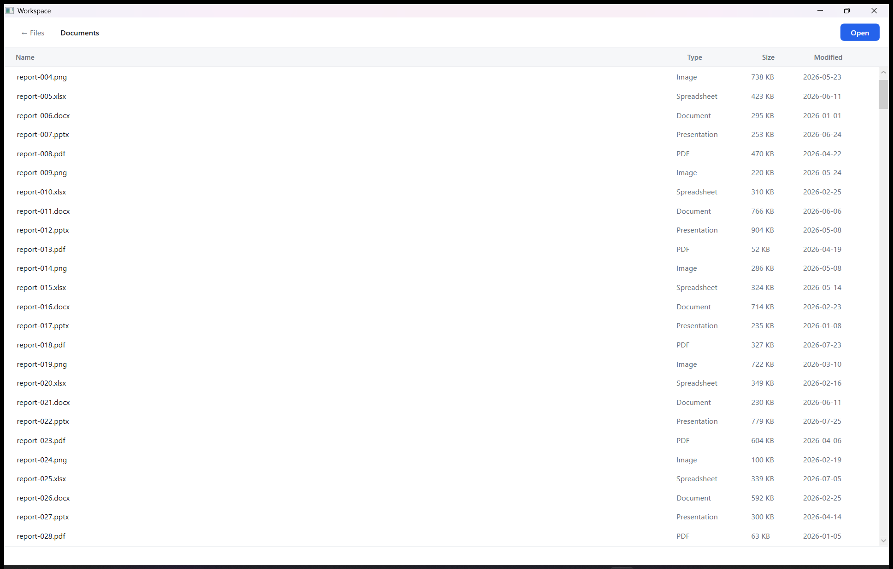

### Step 16:
- **Status**: CONTINUE
- **Request**: In the Files app, open Documents and open the file "Q3-forecast.xlsx".
Use only the already-open desktop.exe application window, which contains all the sub-apps referenced by this task. Do not select or launch any other application.
- **Action**: wheel_mouse_input(id='14', name='report-001.docx', wheel_dist=100)
- **Result**: {'status': 'success', 'error': None, 'result': 'The wheel mouse input action has been executed on the selected control.', 'namespace': 'AppUIExecutor', 'call_id': '91c95111-1c68-4f0a-aa21-82077e657906'}
- **Subtask**: Navigate to the Documents folder and open 'Q3-forecast.xlsx' inside the Files app within the Workspace window.

  
  

