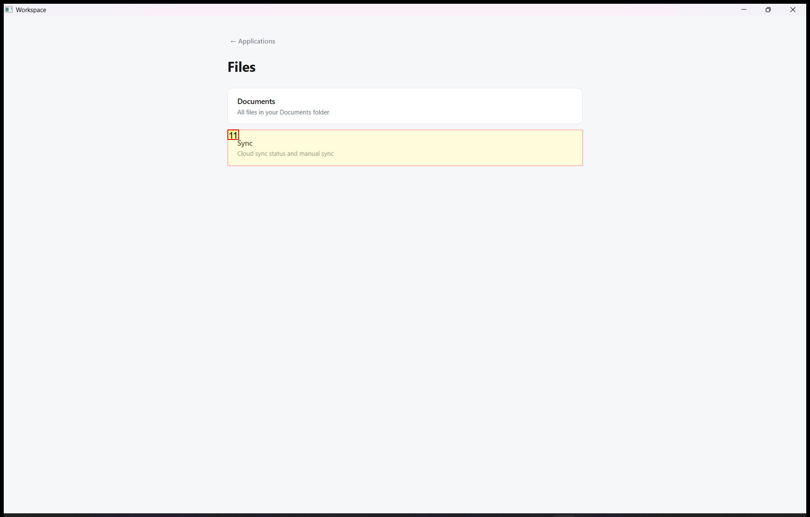
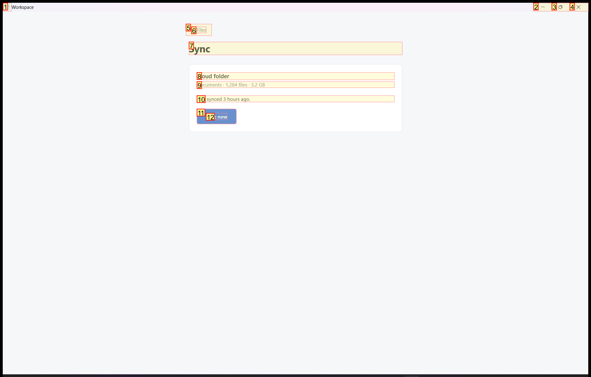
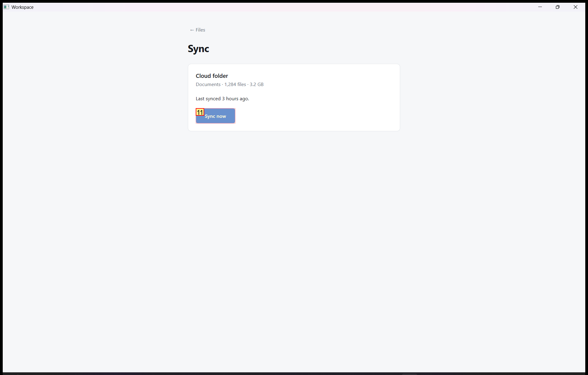

# Trajectory Data

## Summary

- **Request**: In the Files app, open Sync and sync your Documents folder.
Use only the already-open desktop.exe application window, which contains all the sub-apps referenced by this task. Do not select or launch any other application.
- **Total Steps**: 0
- **Total Rounds**: 0
- **Host Agent Steps**: 2
- **App Agent Steps**: 3

## Evaluation Results

No evaluation results found.

### Step 1:
- **Status**: CONTINUE
- **Request**: In the Files app, open Sync and sync your Documents folder.
Use only the already-open desktop.exe application window, which contains all the sub-apps referenced by this task. Do not select or launch any other application.
- **Action**: click_input(id='10', name='Open Files', button='left', double=False)
- **Result**: {'status': 'success', 'error': None, 'result': "Click action has been executed, with parameters: {'button': 'left', 'double': False}", 'namespace': 'AppUIExecutor', 'call_id': '85e1de2b-6f50-4be3-adfe-0b0d109ac1e8'}
- **Subtask**: Open the Files app within the Workspace window, navigate to Sync, and sync the Documents folder.

  
  

### Step 2:
- **Status**: CONTINUE
- **Request**: In the Files app, open Sync and sync your Documents folder.
Use only the already-open desktop.exe application window, which contains all the sub-apps referenced by this task. Do not select or launch any other application.
- **Action**: click_input(id='11', name='Sync', button='left', double=False)
- **Result**: {'status': 'success', 'error': None, 'result': "Click action has been executed, with parameters: {'button': 'left', 'double': False}", 'namespace': 'AppUIExecutor', 'call_id': '933f7648-fd23-46fa-994d-cbe1fe5b2e20'}
- **Subtask**: Open the Files app within the Workspace window, navigate to Sync, and sync the Documents folder.

  
  

### Step 3:
- **Status**: FINISH
- **Request**: In the Files app, open Sync and sync your Documents folder.
Use only the already-open desktop.exe application window, which contains all the sub-apps referenced by this task. Do not select or launch any other application.
- **Action**: click_input(id='11', name='Sync now', button='left', double=False)
- **Result**: {'status': 'success', 'error': None, 'result': "Click action has been executed, with parameters: {'button': 'left', 'double': False}", 'namespace': 'AppUIExecutor', 'call_id': '1462377b-26eb-40d2-afa5-bfa249889d7a'}
- **Subtask**: Open the Files app within the Workspace window, navigate to Sync, and sync the Documents folder.

  
  

