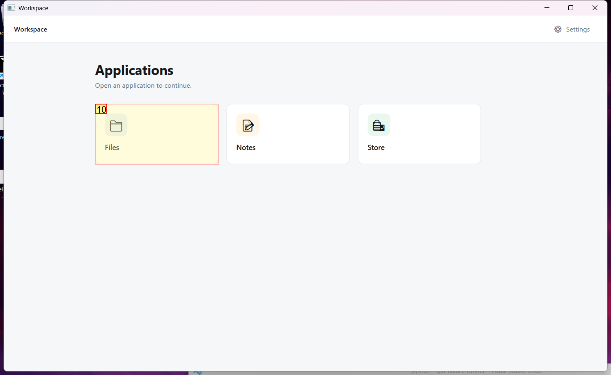
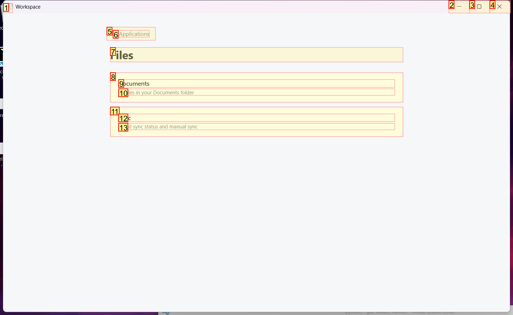
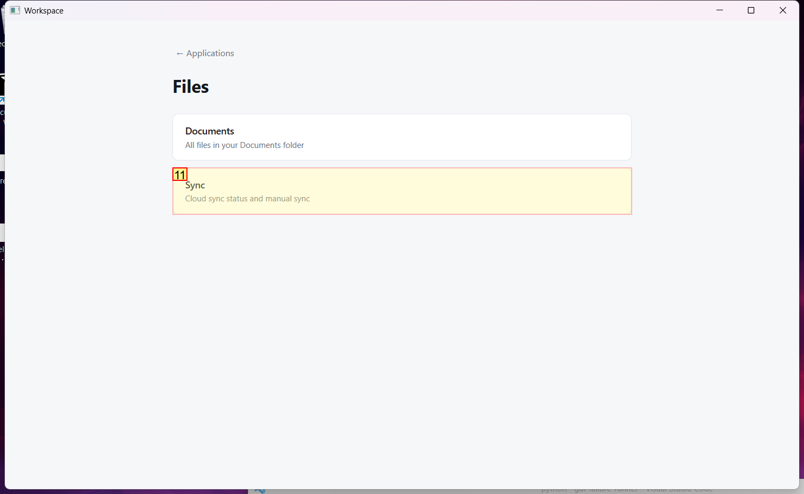
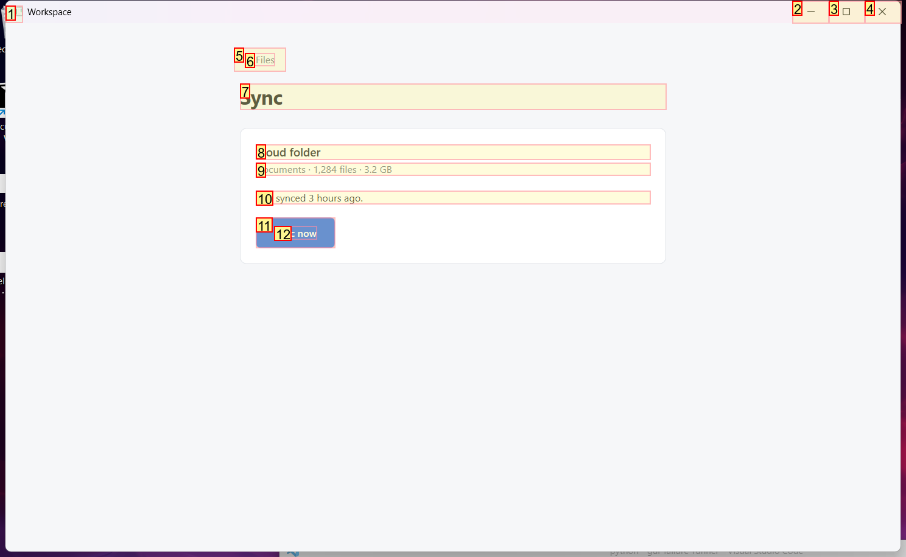
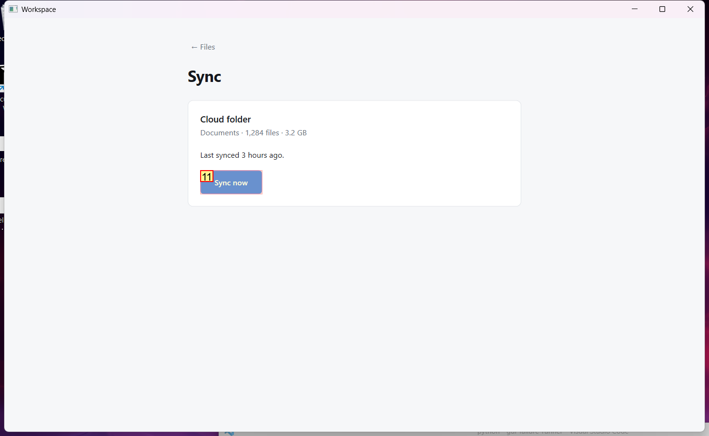

# Trajectory Data

## Summary

- **Request**: In the Files app, open Sync and sync your Documents folder.
Use only the already-open desktop.exe application window, which contains all the sub-apps referenced by this task. Do not select or launch any other application.
- **Total Steps**: 0
- **Total Rounds**: 0
- **Host Agent Steps**: 2
- **App Agent Steps**: 3

## Evaluation Results

No evaluation results found.

### Step 1:
- **Status**: CONTINUE
- **Request**: In the Files app, open Sync and sync your Documents folder.
Use only the already-open desktop.exe application window, which contains all the sub-apps referenced by this task. Do not select or launch any other application.
- **Action**: click_input(id='10', name='Open Files', button='left', double=False)
- **Result**: {'status': 'success', 'error': None, 'result': "Click action has been executed, with parameters: {'button': 'left', 'double': False}", 'namespace': 'AppUIExecutor', 'call_id': '42db2c52-bd94-4b95-857c-4b138e3aa1bb'}
- **Subtask**: Select the Workspace window to access the Files app and Sync settings.

  
  

### Step 2:
- **Status**: CONTINUE
- **Request**: In the Files app, open Sync and sync your Documents folder.
Use only the already-open desktop.exe application window, which contains all the sub-apps referenced by this task. Do not select or launch any other application.
- **Action**: click_input(id='11', name='Sync', button='left', double=False)
- **Result**: {'status': 'success', 'error': None, 'result': "Click action has been executed, with parameters: {'button': 'left', 'double': False}", 'namespace': 'AppUIExecutor', 'call_id': 'd7ca7bc6-2764-4230-8aec-8e062185f265'}
- **Subtask**: Select the Workspace window to access the Files app and Sync settings.

  
  

### Step 3:
- **Status**: FINISH
- **Request**: In the Files app, open Sync and sync your Documents folder.
Use only the already-open desktop.exe application window, which contains all the sub-apps referenced by this task. Do not select or launch any other application.
- **Action**: click_input(id='11', name='Sync now', button='left', double=False)
- **Result**: {'status': 'success', 'error': None, 'result': "Click action has been executed, with parameters: {'button': 'left', 'double': False}", 'namespace': 'AppUIExecutor', 'call_id': 'b8b6d84b-44c4-43d4-a06e-51d6ff569019'}
- **Subtask**: Select the Workspace window to access the Files app and Sync settings.

  
  

