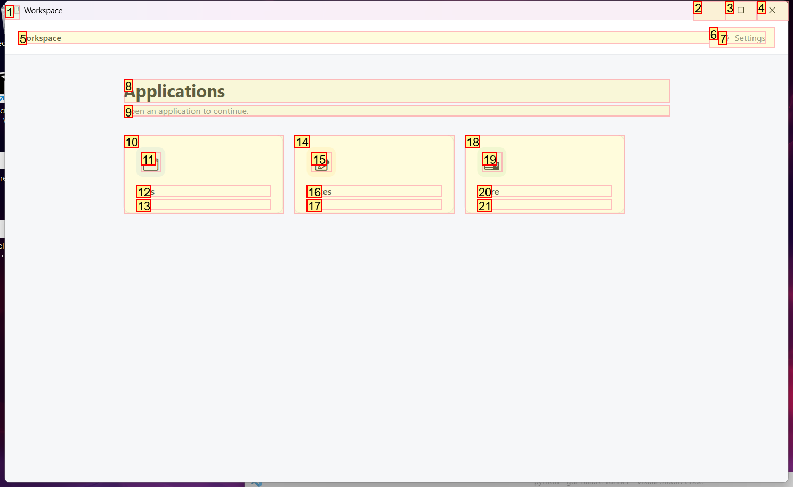
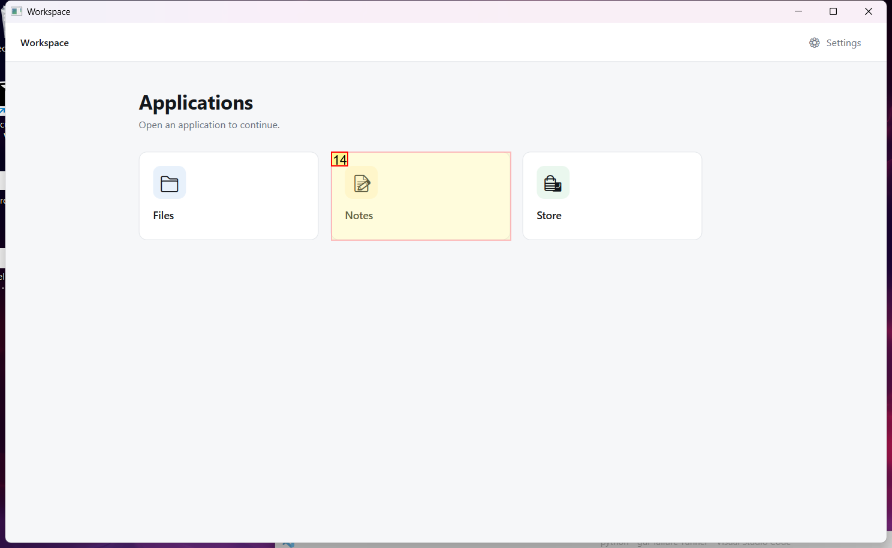
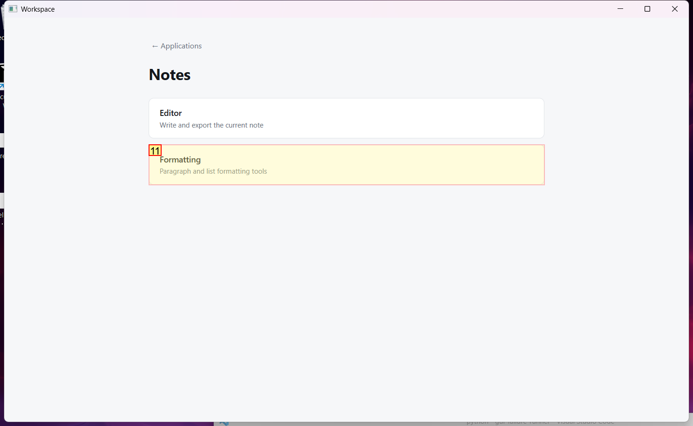
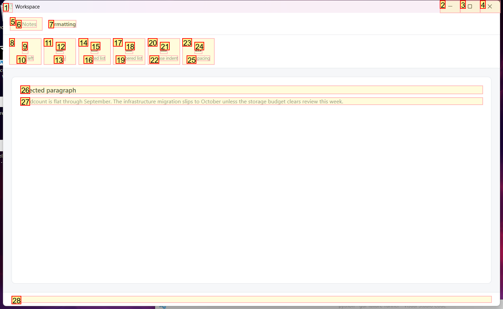
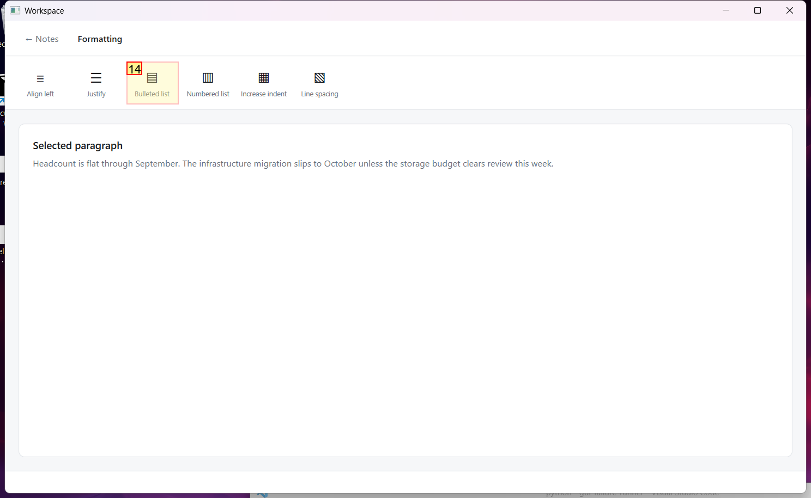

# Trajectory Data

## Summary

- **Request**: In the Notes app, open Formatting and apply a bulleted list to the selected paragraph.
Use only the already-open desktop.exe application window, which contains all the sub-apps referenced by this task. Do not select or launch any other application.
- **Total Steps**: 0
- **Total Rounds**: 0
- **Host Agent Steps**: 2
- **App Agent Steps**: 3

## Evaluation Results

No evaluation results found.

### Step 1:
- **Status**: CONTINUE
- **Request**: In the Notes app, open Formatting and apply a bulleted list to the selected paragraph.
Use only the already-open desktop.exe application window, which contains all the sub-apps referenced by this task. Do not select or launch any other application.
- **Action**: click_input(id='14', name='Open Notes', button='left', double=False)
- **Result**: {'status': 'success', 'error': None, 'result': "Click action has been executed, with parameters: {'button': 'left', 'double': False}", 'namespace': 'AppUIExecutor', 'call_id': 'e6172532-d3e9-4f68-9775-5b809b5881af'}
- **Subtask**: Select the Workspace window to access the Notes app and apply formatting.

  
  

### Step 2:
- **Status**: CONTINUE
- **Request**: In the Notes app, open Formatting and apply a bulleted list to the selected paragraph.
Use only the already-open desktop.exe application window, which contains all the sub-apps referenced by this task. Do not select or launch any other application.
- **Action**: click_input(id='11', name='Formatting', button='left', double=False)
- **Result**: {'status': 'success', 'error': None, 'result': "Click action has been executed, with parameters: {'button': 'left', 'double': False}", 'namespace': 'AppUIExecutor', 'call_id': 'd39689ae-d2ce-487b-8911-53a2409f8cd3'}
- **Subtask**: Select the Workspace window to access the Notes app and apply formatting.

  
  

### Step 3:
- **Status**: FINISH
- **Request**: In the Notes app, open Formatting and apply a bulleted list to the selected paragraph.
Use only the already-open desktop.exe application window, which contains all the sub-apps referenced by this task. Do not select or launch any other application.
- **Action**: click_input(id='14', name='Bulleted list', button='left', double=False)
- **Result**: {'status': 'success', 'error': None, 'result': "Click action has been executed, with parameters: {'button': 'left', 'double': False}", 'namespace': 'AppUIExecutor', 'call_id': '9630e6b1-68bd-4651-98eb-a35b19b31806'}
- **Subtask**: Select the Workspace window to access the Notes app and apply formatting.

  
  

