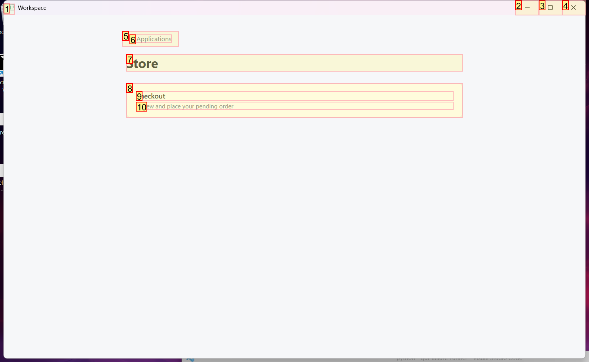
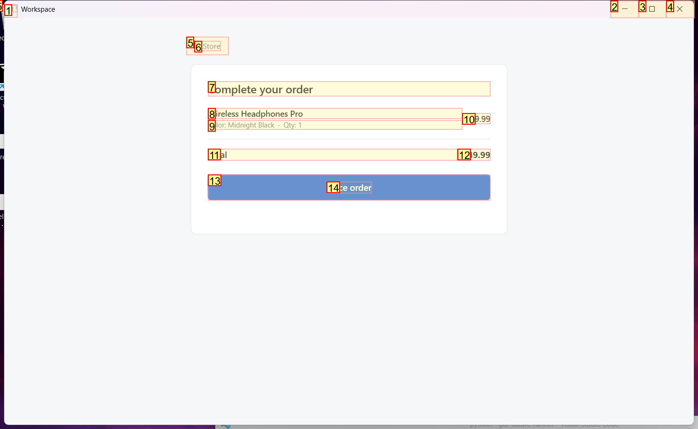
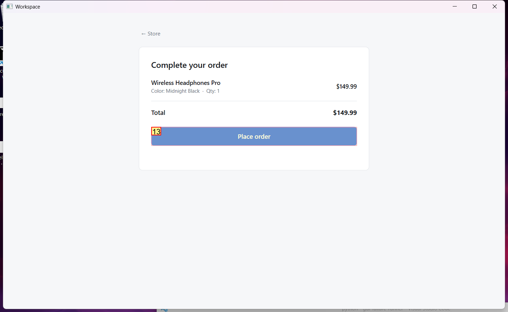

# Trajectory Data

## Summary

- **Request**: In the Store app, open Checkout and place the pending order.
Use only the already-open desktop.exe application window, which contains all the sub-apps referenced by this task. Do not select or launch any other application.
- **Total Steps**: 0
- **Total Rounds**: 0
- **Host Agent Steps**: 2
- **App Agent Steps**: 3

## Evaluation Results

No evaluation results found.

### Step 1:
- **Status**: CONTINUE
- **Request**: In the Store app, open Checkout and place the pending order.
Use only the already-open desktop.exe application window, which contains all the sub-apps referenced by this task. Do not select or launch any other application.
- **Action**: click_input(id='18', name='Open Store', button='left', double=False)
- **Result**: {'status': 'success', 'error': None, 'result': "Click action has been executed, with parameters: {'button': 'left', 'double': False}", 'namespace': 'AppUIExecutor', 'call_id': '0df0363c-f6ff-43b5-ad34-93006bb92bf2'}
- **Subtask**: Open the Store app within the Workspace, navigate to Checkout, and place the pending order.

  
  

### Step 2:
- **Status**: CONTINUE
- **Request**: In the Store app, open Checkout and place the pending order.
Use only the already-open desktop.exe application window, which contains all the sub-apps referenced by this task. Do not select or launch any other application.
- **Action**: click_input(id='8', name='Checkout', button='left', double=False)
- **Result**: {'status': 'success', 'error': None, 'result': "Click action has been executed, with parameters: {'button': 'left', 'double': False}", 'namespace': 'AppUIExecutor', 'call_id': '31d5306b-0ea2-48bb-9f70-612eac5baec7'}
- **Subtask**: Open the Store app within the Workspace, navigate to Checkout, and place the pending order.

  
  

### Step 3:
- **Status**: FINISH
- **Request**: In the Store app, open Checkout and place the pending order.
Use only the already-open desktop.exe application window, which contains all the sub-apps referenced by this task. Do not select or launch any other application.
- **Action**: click_input(id='13', name='Place order', button='left', double=False)
- **Result**: {'status': 'success', 'error': None, 'result': "Click action has been executed, with parameters: {'button': 'left', 'double': False}", 'namespace': 'AppUIExecutor', 'call_id': '4b388dc8-5d53-4a34-8ca4-02cf907d1f73'}
- **Subtask**: Open the Store app within the Workspace, navigate to Checkout, and place the pending order.

  
  

