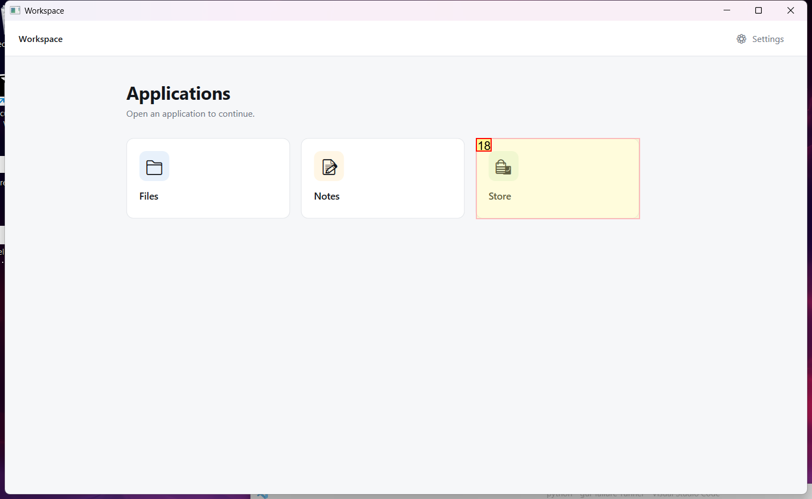
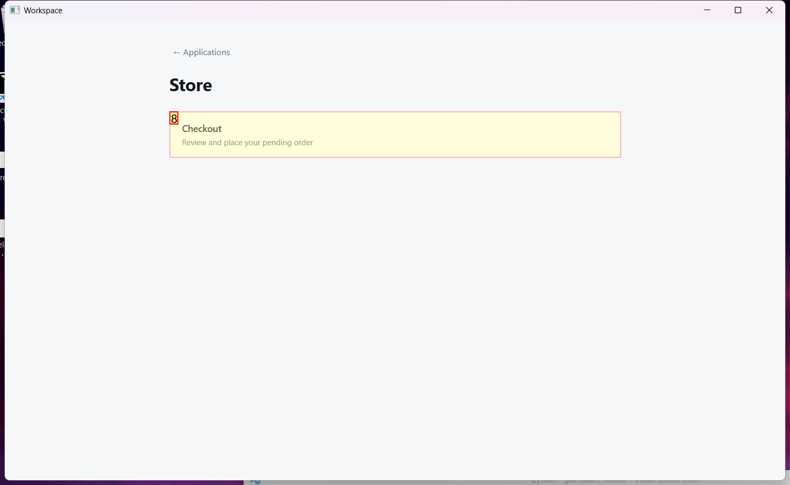

# Trajectory Data

## Summary

- **Request**: In the Store app, open Checkout and place the pending order.
Use only the already-open desktop.exe application window, which contains all the sub-apps referenced by this task. Do not select or launch any other application.
- **Total Steps**: 0
- **Total Rounds**: 0
- **Host Agent Steps**: 2
- **App Agent Steps**: 3

## Evaluation Results

No evaluation results found.

### Step 1:
- **Status**: CONTINUE
- **Request**: In the Store app, open Checkout and place the pending order.
Use only the already-open desktop.exe application window, which contains all the sub-apps referenced by this task. Do not select or launch any other application.
- **Action**: click_input(id='18', name='Open Store', button='left', double=False)
- **Result**: {'status': 'success', 'error': None, 'result': "Click action has been executed, with parameters: {'button': 'left', 'double': False}", 'namespace': 'AppUIExecutor', 'call_id': '6359d191-4b1c-4faa-9c12-95f63ad52fdb'}
- **Subtask**: Select the Workspace window to access the Store app and Checkout.

  
  

### Step 2:
- **Status**: CONTINUE
- **Request**: In the Store app, open Checkout and place the pending order.
Use only the already-open desktop.exe application window, which contains all the sub-apps referenced by this task. Do not select or launch any other application.
- **Action**: click_input(id='8', name='Checkout', button='left', double=False)
- **Result**: {'status': 'success', 'error': None, 'result': "Click action has been executed, with parameters: {'button': 'left', 'double': False}", 'namespace': 'AppUIExecutor', 'call_id': '47e39638-8150-4f48-a7aa-ed6be3ad24d6'}
- **Subtask**: Select the Workspace window to access the Store app and Checkout.

  
  

### Step 3:
- **Status**: FINISH
- **Request**: In the Store app, open Checkout and place the pending order.
Use only the already-open desktop.exe application window, which contains all the sub-apps referenced by this task. Do not select or launch any other application.
- **Action**: click_input(id='13', name='Place order', button='left', double=False)
- **Result**: {'status': 'success', 'error': None, 'result': "Click action has been executed, with parameters: {'button': 'left', 'double': False}", 'namespace': 'AppUIExecutor', 'call_id': 'de165b57-44dd-4a19-93a6-ae3c630c2677'}
- **Subtask**: Select the Workspace window to access the Store app and Checkout.

  
  

