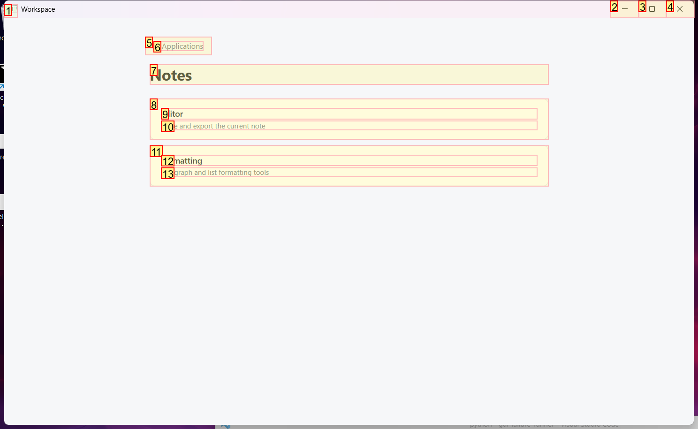
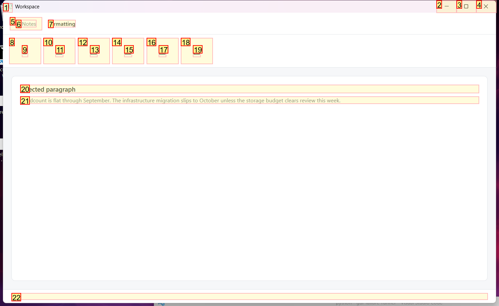
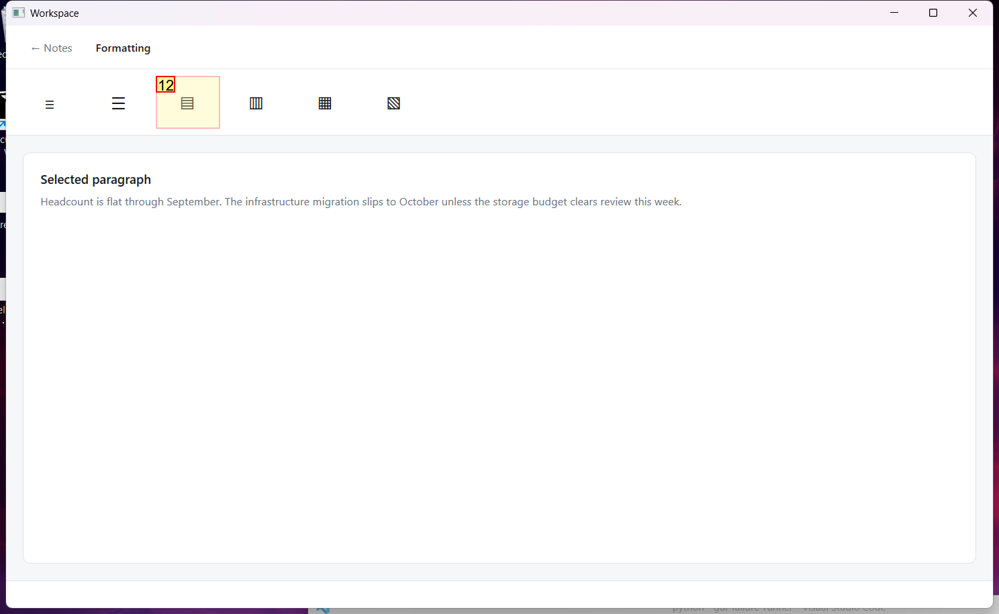

# Trajectory Data

## Summary

- **Request**: In the Notes app, open Formatting and apply a bulleted list to the selected paragraph.
Use only the already-open desktop.exe application window, which contains all the sub-apps referenced by this task. Do not select or launch any other application.
- **Total Steps**: 0
- **Total Rounds**: 0
- **Host Agent Steps**: 2
- **App Agent Steps**: 3

## Evaluation Results

No evaluation results found.

### Step 1:
- **Status**: CONTINUE
- **Request**: In the Notes app, open Formatting and apply a bulleted list to the selected paragraph.
Use only the already-open desktop.exe application window, which contains all the sub-apps referenced by this task. Do not select or launch any other application.
- **Action**: click_input(id='14', name='Open Notes', button='left', double=False)
- **Result**: {'status': 'success', 'error': None, 'result': "Click action has been executed, with parameters: {'button': 'left', 'double': False}", 'namespace': 'AppUIExecutor', 'call_id': '31ec2136-b0da-484f-ad24-2f36863e6cd6'}
- **Subtask**: Open the 'Notes' app inside the Workspace, open 'Formatting', and apply a bulleted list to the selected paragraph.

  
  

### Step 2:
- **Status**: CONTINUE
- **Request**: In the Notes app, open Formatting and apply a bulleted list to the selected paragraph.
Use only the already-open desktop.exe application window, which contains all the sub-apps referenced by this task. Do not select or launch any other application.
- **Action**: click_input(id='11', name='Formatting', button='left', double=False)
- **Result**: {'status': 'success', 'error': None, 'result': "Click action has been executed, with parameters: {'button': 'left', 'double': False}", 'namespace': 'AppUIExecutor', 'call_id': 'a5f27d61-b9d2-40bd-9af2-36c3f46f60af'}
- **Subtask**: Open the 'Notes' app inside the Workspace, open 'Formatting', and apply a bulleted list to the selected paragraph.

  
  

### Step 3:
- **Status**: FINISH
- **Request**: In the Notes app, open Formatting and apply a bulleted list to the selected paragraph.
Use only the already-open desktop.exe application window, which contains all the sub-apps referenced by this task. Do not select or launch any other application.
- **Action**: click_input(id='12', name='Bulleted list', button='left', double=False)
- **Result**: {'status': 'success', 'error': None, 'result': "Click action has been executed, with parameters: {'button': 'left', 'double': False}", 'namespace': 'AppUIExecutor', 'call_id': 'f12fa613-9235-453d-be07-1a440a65f998'}
- **Subtask**: Open the 'Notes' app inside the Workspace, open 'Formatting', and apply a bulleted list to the selected paragraph.

  
  

