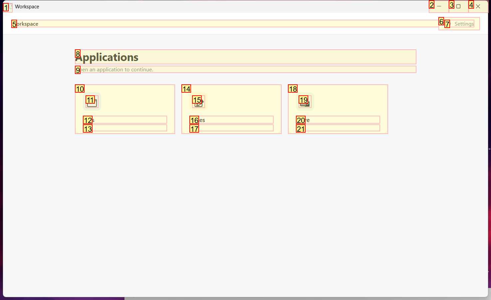
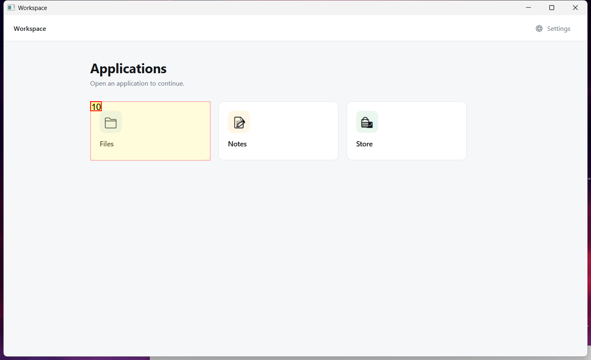
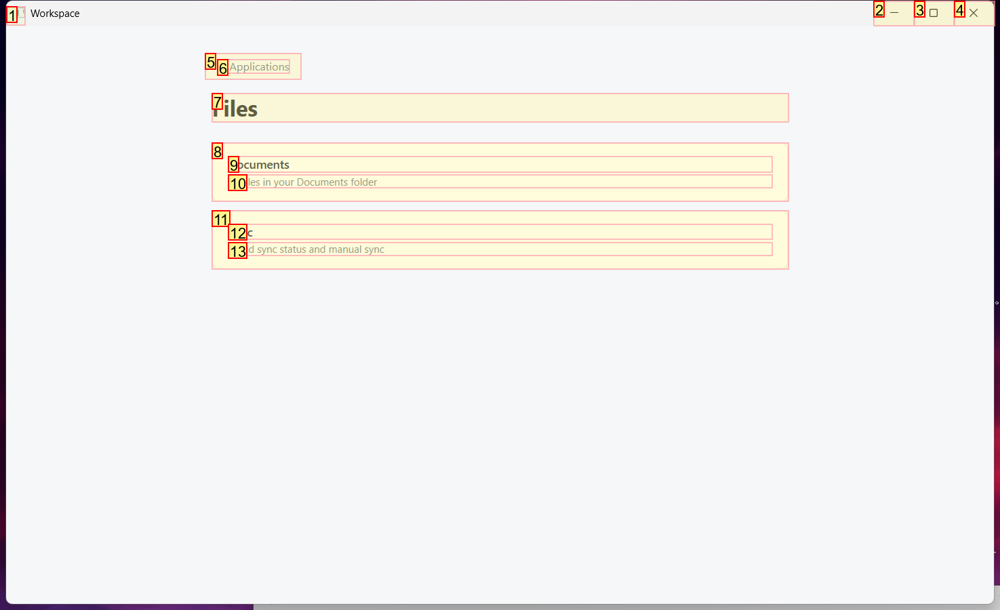
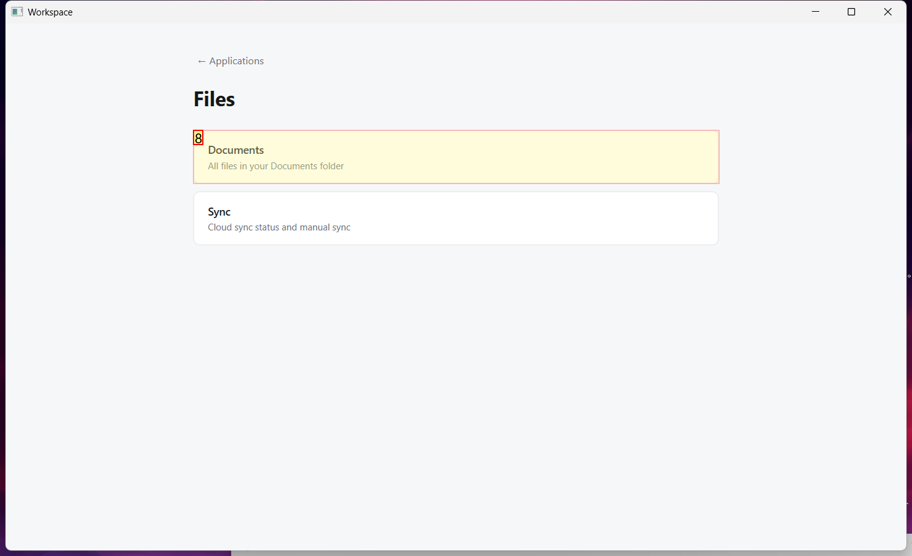
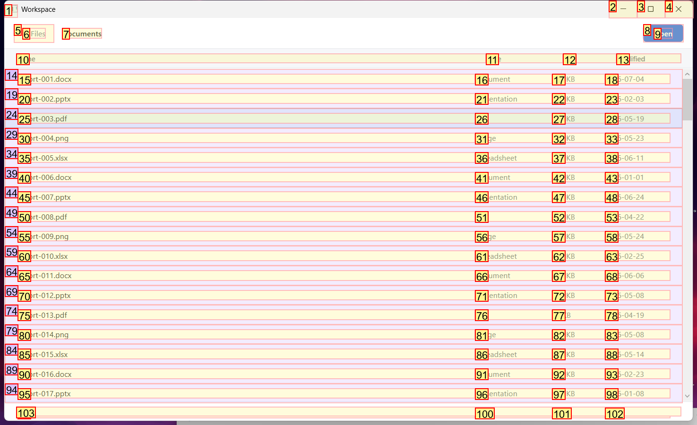
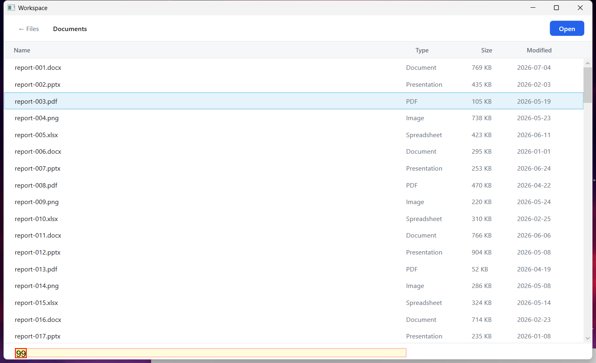
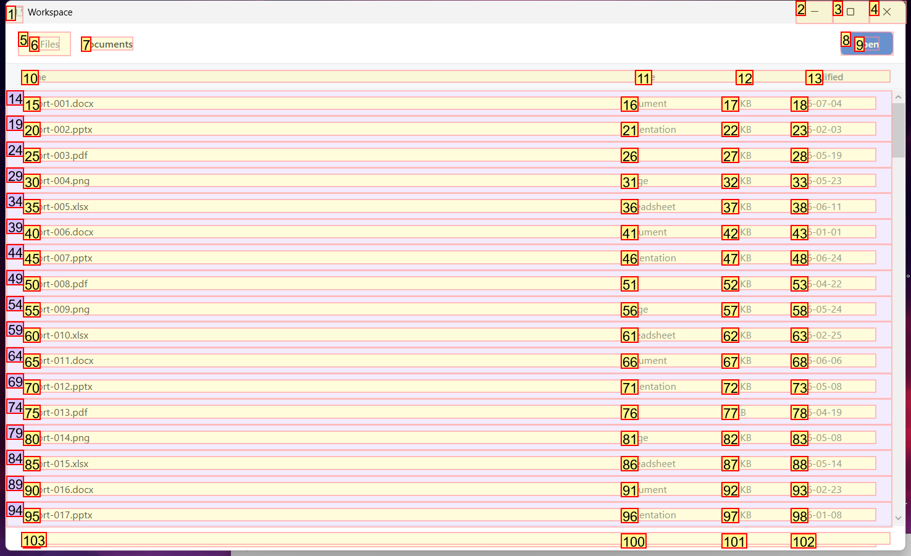
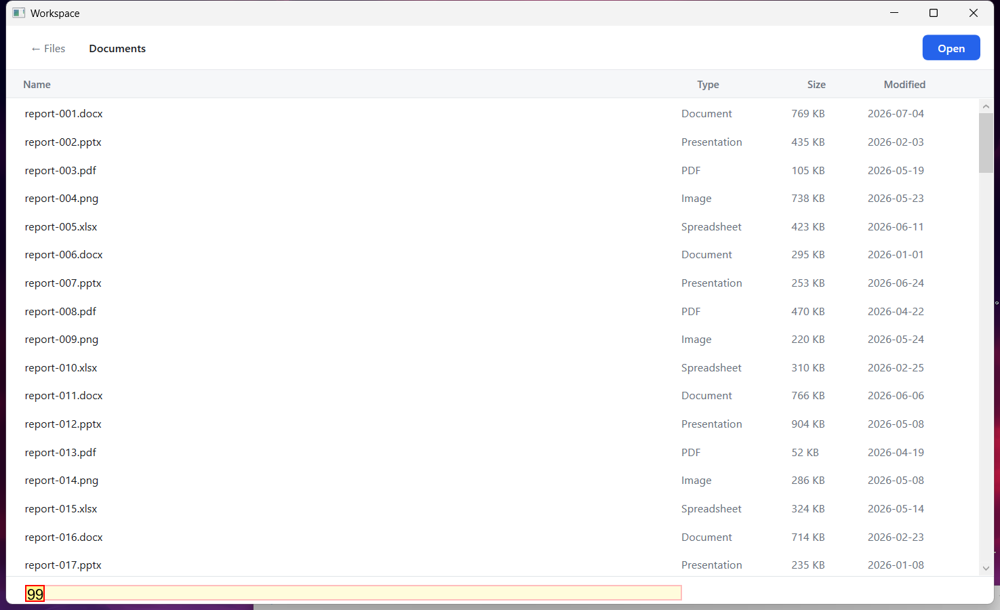

# Trajectory Data

## Summary

- **Request**: In the Files app, open Documents and open the file "Q3-forecast.xlsx".
Use only the already-open desktop.exe application window, which contains all the sub-apps referenced by this task. Do not select or launch any other application.
- **Total Steps**: 0
- **Total Rounds**: 0
- **Host Agent Steps**: 1
- **App Agent Steps**: 9

## Evaluation Results

No evaluation results found.

### Step 1:
- **Status**: CONTINUE
- **Request**: In the Files app, open Documents and open the file "Q3-forecast.xlsx".
Use only the already-open desktop.exe application window, which contains all the sub-apps referenced by this task. Do not select or launch any other application.
- **Action**: click_input(id='10', name='Open Files', button='left', double=False)
- **Result**: {'status': 'success', 'error': None, 'result': "Click action has been executed, with parameters: {'button': 'left', 'double': False}", 'namespace': 'AppUIExecutor', 'call_id': '05072afe-25ba-4879-9e24-6a8806ee289a'}
- **Subtask**: Select the Workspace window to access the simulated desktop and open the Files app.

  
  

### Step 2:
- **Status**: CONTINUE
- **Request**: In the Files app, open Documents and open the file "Q3-forecast.xlsx".
Use only the already-open desktop.exe application window, which contains all the sub-apps referenced by this task. Do not select or launch any other application.
- **Action**: click_input(id='8', name='Documents', button='left', double=False)
- **Result**: {'status': 'success', 'error': None, 'result': "Click action has been executed, with parameters: {'button': 'left', 'double': False}", 'namespace': 'AppUIExecutor', 'call_id': 'd6875004-bf64-444d-8d14-4b227aa2b3a6'}
- **Subtask**: Select the Workspace window to access the simulated desktop and open the Files app.

  
  

### Step 3:
- **Status**: CONTINUE
- **Request**: In the Files app, open Documents and open the file "Q3-forecast.xlsx".
Use only the already-open desktop.exe application window, which contains all the sub-apps referenced by this task. Do not select or launch any other application.
- **Action**: wheel_mouse_input(id='99', name='report-018.pdf', wheel_dist=-10)
- **Result**: {'status': 'success', 'error': None, 'result': 'The wheel mouse input action has been executed on the selected control.', 'namespace': 'AppUIExecutor', 'call_id': 'fb13d348-f8c5-44e4-96a9-d775e6eb4201'}
- **Subtask**: Select the Workspace window to access the simulated desktop and open the Files app.

  
  

### Step 4:
- **Status**: CONTINUE
- **Request**: In the Files app, open Documents and open the file "Q3-forecast.xlsx".
Use only the already-open desktop.exe application window, which contains all the sub-apps referenced by this task. Do not select or launch any other application.
- **Action**: wheel_mouse_input(id='99', name='report-018.pdf', wheel_dist=-30)
- **Result**: {'status': 'success', 'error': None, 'result': 'The wheel mouse input action has been executed on the selected control.', 'namespace': 'AppUIExecutor', 'call_id': 'd84a2bb2-7da3-4f32-ad5d-b51c6fdacada'}
- **Subtask**: Select the Workspace window to access the simulated desktop and open the Files app.

  
  

### Step 5:
- **Status**: CONTINUE
- **Request**: In the Files app, open Documents and open the file "Q3-forecast.xlsx".
Use only the already-open desktop.exe application window, which contains all the sub-apps referenced by this task. Do not select or launch any other application.
- **Action**: keyboard_input(id='99', name='report-018.pdf', keys='{PGDN}', control_focus=True)
- **Result**: {'status': 'success', 'error': None, 'result': '{PGDN}', 'namespace': 'AppUIExecutor', 'call_id': 'e9187272-dbf8-4e13-aa11-476d0f6c6505'}
- **Subtask**: Select the Workspace window to access the simulated desktop and open the Files app.

  
  

### Step 6:
- **Status**: CONTINUE
- **Request**: In the Files app, open Documents and open the file "Q3-forecast.xlsx".
Use only the already-open desktop.exe application window, which contains all the sub-apps referenced by this task. Do not select or launch any other application.
- **Action**: click_input(id='99', name='report-018.pdf', button='left', double=False)
- **Result**: {'status': 'success', 'error': None, 'result': "Click action has been executed, with parameters: {'button': 'left', 'double': False}", 'namespace': 'AppUIExecutor', 'call_id': '71391e63-9fbd-419e-91ac-4413a4eb36ba'}
- **Subtask**: Select the Workspace window to access the simulated desktop and open the Files app.

  
  

### Step 7:
- **Status**: CONTINUE
- **Request**: In the Files app, open Documents and open the file "Q3-forecast.xlsx".
Use only the already-open desktop.exe application window, which contains all the sub-apps referenced by this task. Do not select or launch any other application.
- **Action**: keyboard_input(id='99', name='report-018.pdf', keys='{PGDN}', control_focus=True)
- **Result**: {'status': 'success', 'error': None, 'result': '{PGDN}', 'namespace': 'AppUIExecutor', 'call_id': '83c22ff2-7ecf-4685-96b2-6043b4f67869'}
- **Subtask**: Select the Workspace window to access the simulated desktop and open the Files app.

  
  

### Step 8:
- **Status**: CONTINUE
- **Request**: In the Files app, open Documents and open the file "Q3-forecast.xlsx".
Use only the already-open desktop.exe application window, which contains all the sub-apps referenced by this task. Do not select or launch any other application.
- **Action**: keyboard_input(id='99', name='report-018.pdf', keys='q', control_focus=True)
- **Result**: {'status': 'success', 'error': None, 'result': 'q', 'namespace': 'AppUIExecutor', 'call_id': 'e6c34911-7b0d-47d5-a471-79a50be1f120'}
- **Subtask**: Select the Workspace window to access the simulated desktop and open the Files app.

  
  

### Step 9:
- **Status**: CONTINUE
- **Request**: In the Files app, open Documents and open the file "Q3-forecast.xlsx".
Use only the already-open desktop.exe application window, which contains all the sub-apps referenced by this task. Do not select or launch any other application.
- **Action**: keyboard_input(id='99', name='report-018.pdf', keys='{DOWN 10}', control_focus=True)
- **Result**: {'status': 'success', 'error': None, 'result': '{DOWN 10}', 'namespace': 'AppUIExecutor', 'call_id': 'e795e724-490b-4907-98f9-f84d89151e75'}
- **Subtask**: Select the Workspace window to access the simulated desktop and open the Files app.

  
  

