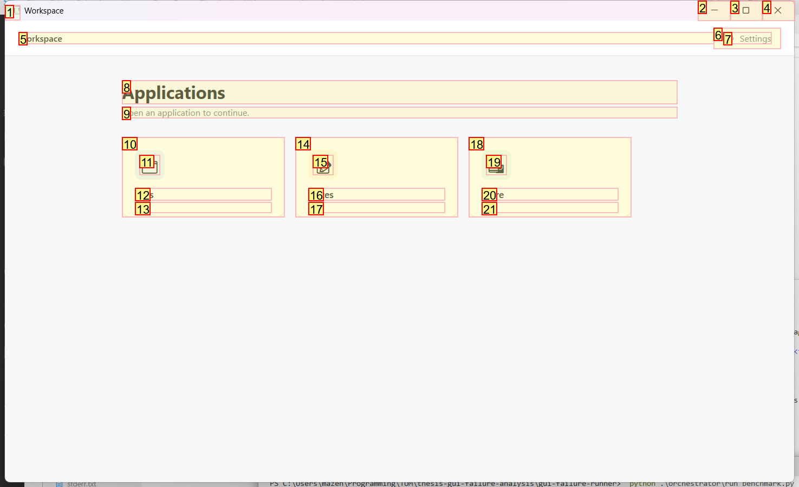
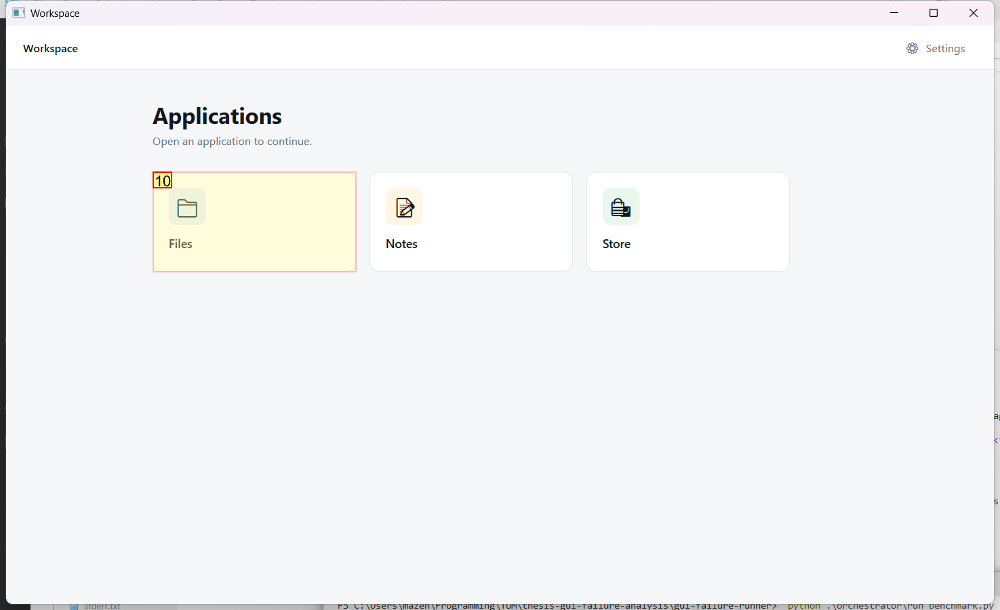
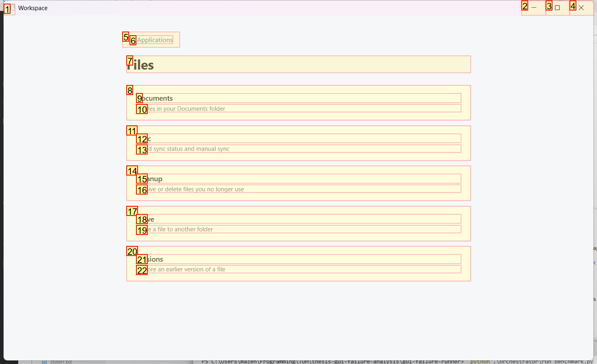
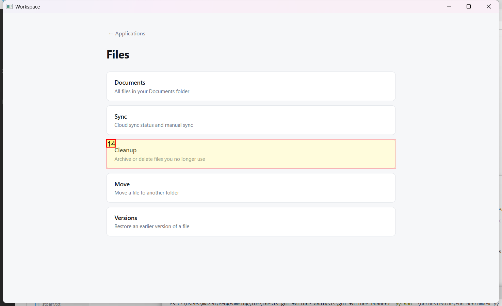
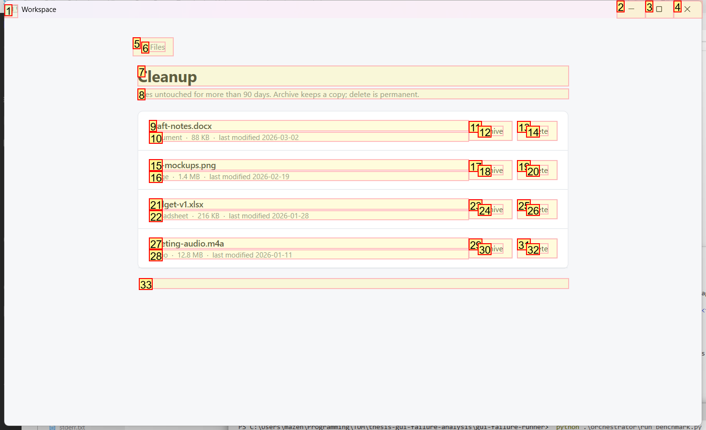
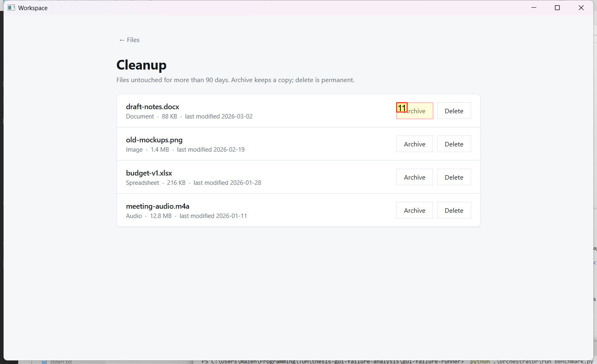

# Trajectory Data

## Summary

- **Request**: In the Files app, open Cleanup and archive the file "draft-notes.docx".
Use only the already-open desktop.exe application window, which contains all the sub-apps referenced by this task. Do not select or launch any other application.
- **Total Steps**: 0
- **Total Rounds**: 0
- **Host Agent Steps**: 2
- **App Agent Steps**: 3

## Evaluation Results

No evaluation results found.

### Step 1:
- **Status**: CONTINUE
- **Request**: In the Files app, open Cleanup and archive the file "draft-notes.docx".
Use only the already-open desktop.exe application window, which contains all the sub-apps referenced by this task. Do not select or launch any other application.
- **Action**: click_input(id='10', name='Open Files', button='left', double=False)
- **Result**: {'status': 'success', 'error': None, 'result': "Click action has been executed, with parameters: {'button': 'left', 'double': False}", 'namespace': 'AppUIExecutor', 'call_id': '8ed4052d-64f8-4f57-8e10-ba165401a260'}
- **Subtask**: Open the 'Files' app inside the Workspace window, navigate to 'Cleanup', and archive the file 'draft-notes.docx'.

  
  

### Step 2:
- **Status**: CONTINUE
- **Request**: In the Files app, open Cleanup and archive the file "draft-notes.docx".
Use only the already-open desktop.exe application window, which contains all the sub-apps referenced by this task. Do not select or launch any other application.
- **Action**: click_input(id='14', name='Cleanup', button='left', double=False)
- **Result**: {'status': 'success', 'error': None, 'result': "Click action has been executed, with parameters: {'button': 'left', 'double': False}", 'namespace': 'AppUIExecutor', 'call_id': '9c497439-f2a1-4ffb-bd55-14d3d900a9a8'}
- **Subtask**: Open the 'Files' app inside the Workspace window, navigate to 'Cleanup', and archive the file 'draft-notes.docx'.

  
  

### Step 3:
- **Status**: FINISH
- **Request**: In the Files app, open Cleanup and archive the file "draft-notes.docx".
Use only the already-open desktop.exe application window, which contains all the sub-apps referenced by this task. Do not select or launch any other application.
- **Action**: click_input(id='11', name='Archive', button='left', double=False)
- **Result**: {'status': 'success', 'error': None, 'result': "Click action has been executed, with parameters: {'button': 'left', 'double': False}", 'namespace': 'AppUIExecutor', 'call_id': '16b8261f-0cda-4fb2-b39b-a7bef579b439'}
- **Subtask**: Open the 'Files' app inside the Workspace window, navigate to 'Cleanup', and archive the file 'draft-notes.docx'.

  
  

