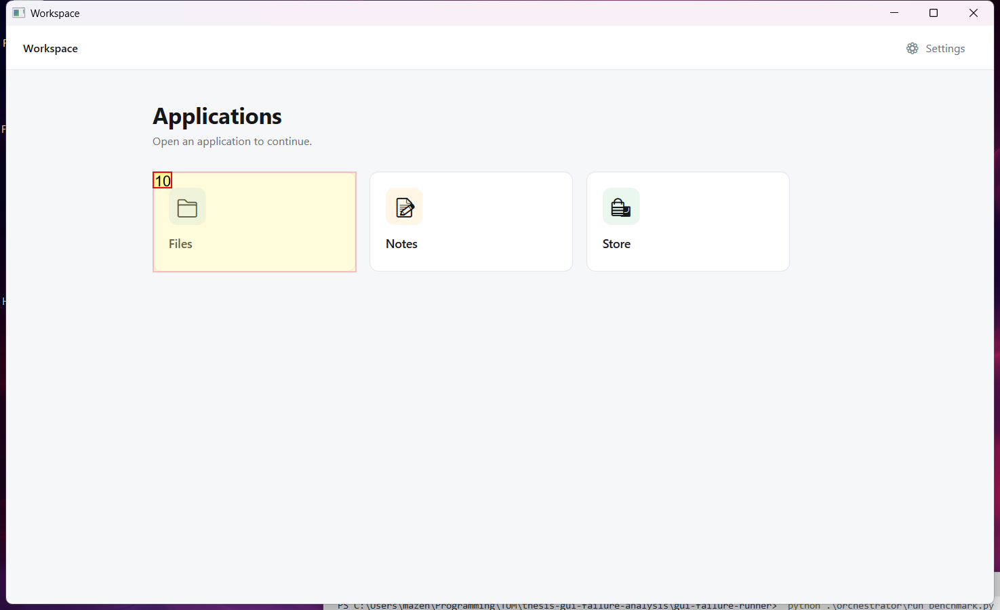
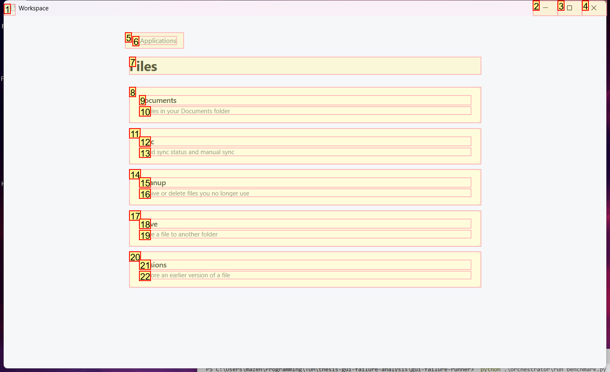
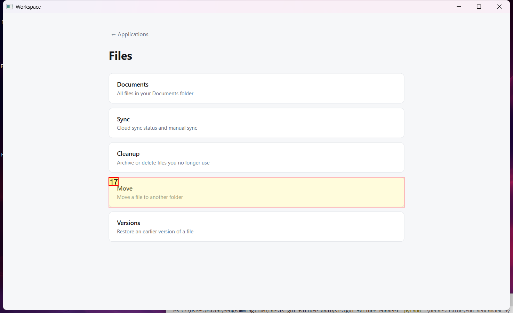
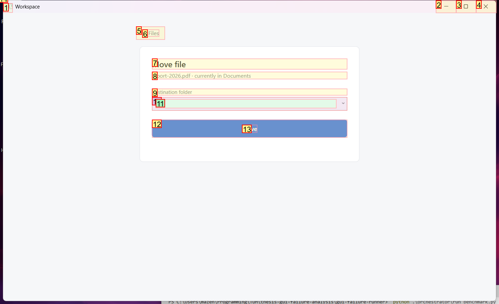
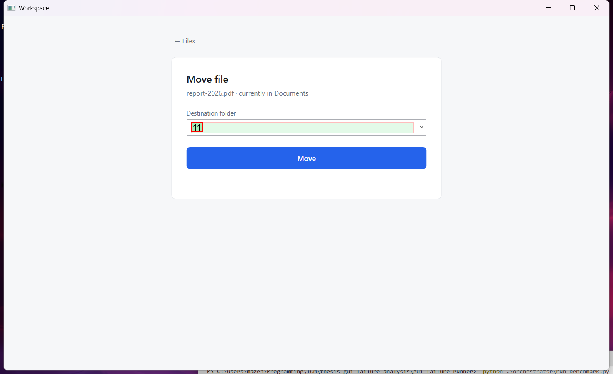
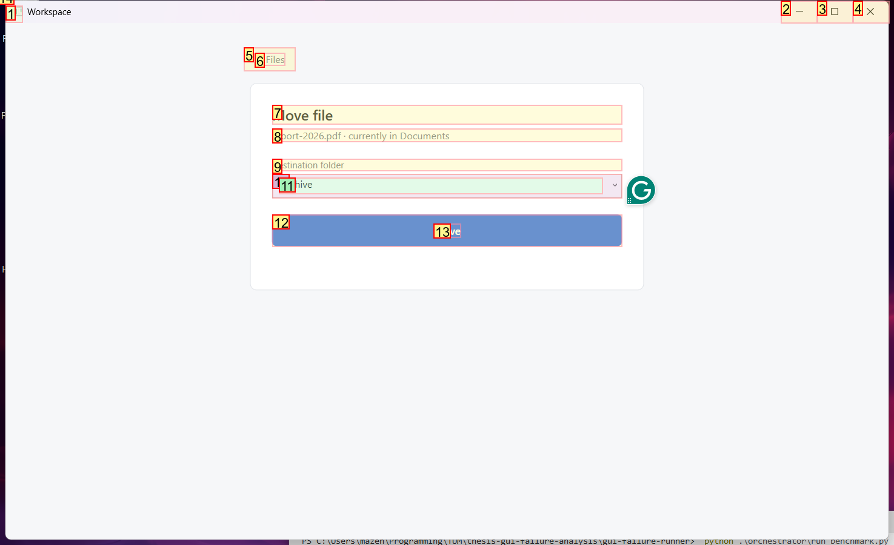
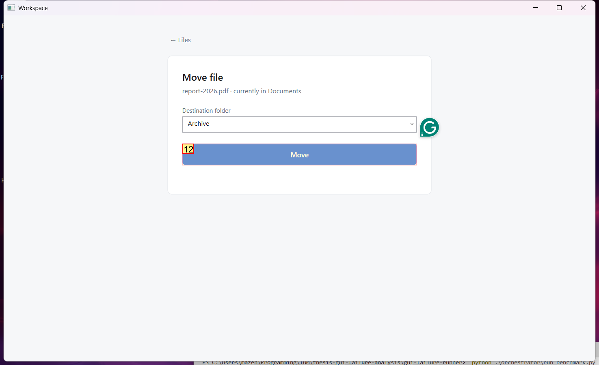
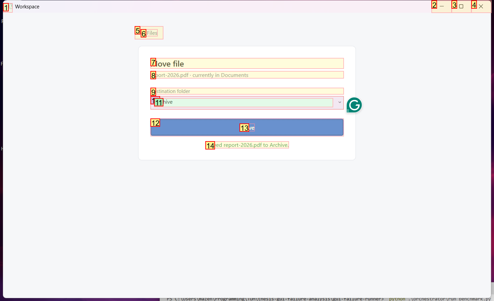
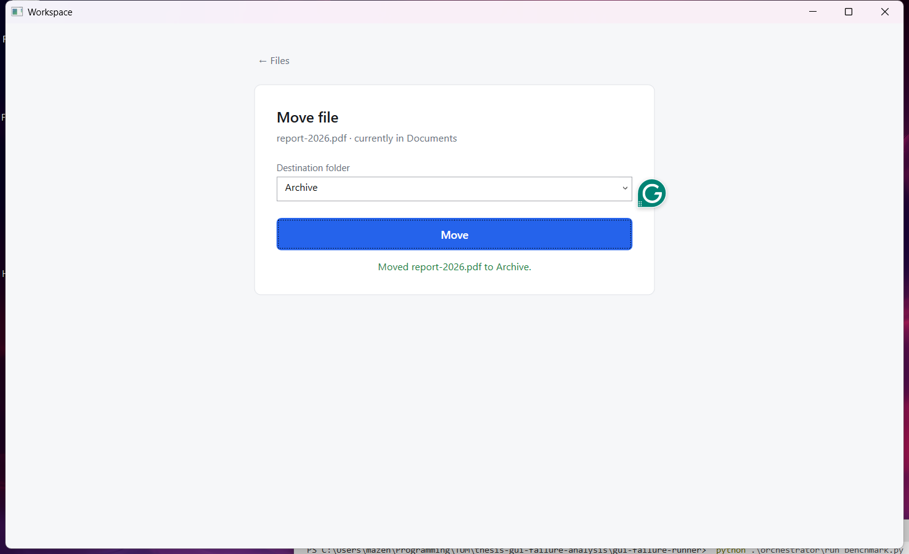

# Trajectory Data

## Summary

- **Request**: In the Files app, open Move and move "report-2026.pdf" to the Archive folder.
Use only the already-open desktop.exe application window, which contains all the sub-apps referenced by this task. Do not select or launch any other application.
- **Total Steps**: 0
- **Total Rounds**: 0
- **Host Agent Steps**: 2
- **App Agent Steps**: 5

## Evaluation Results

No evaluation results found.

### Step 1:
- **Status**: CONTINUE
- **Request**: In the Files app, open Move and move "report-2026.pdf" to the Archive folder.
Use only the already-open desktop.exe application window, which contains all the sub-apps referenced by this task. Do not select or launch any other application.
- **Action**: click_input(id='10', name='Open Files', button='left', double=False)
- **Result**: {'status': 'success', 'error': None, 'result': "Click action has been executed, with parameters: {'button': 'left', 'double': False}", 'namespace': 'AppUIExecutor', 'call_id': '4045f89a-3731-4e07-b1e2-0efc4a3a0236'}
- **Subtask**: Select the Workspace window to access the Files app and move 'report-2026.pdf' to the Archive folder.

  
  

### Step 2:
- **Status**: CONTINUE
- **Request**: In the Files app, open Move and move "report-2026.pdf" to the Archive folder.
Use only the already-open desktop.exe application window, which contains all the sub-apps referenced by this task. Do not select or launch any other application.
- **Action**: click_input(id='17', name='Move', button='left', double=False)
- **Result**: {'status': 'success', 'error': None, 'result': "Click action has been executed, with parameters: {'button': 'left', 'double': False}", 'namespace': 'AppUIExecutor', 'call_id': '0d668e40-cf27-4a7c-865e-a84da713fc82'}
- **Subtask**: Select the Workspace window to access the Files app and move 'report-2026.pdf' to the Archive folder.

  
  

### Step 3:
- **Status**: CONTINUE
- **Request**: In the Files app, open Move and move "report-2026.pdf" to the Archive folder.
Use only the already-open desktop.exe application window, which contains all the sub-apps referenced by this task. Do not select or launch any other application.
- **Action**: set_edit_text(id='11', name='Destination folder', text='Archive', clear_current_text=True)
- **Result**: {'status': 'success', 'error': None, 'result': "Executed action set_edit_text(text='Archive', clear_current_text=True), please check the application for whether it took effect.", 'namespace': 'AppUIExecutor', 'call_id': '22c89bf5-0e4c-424f-8aa2-48f8a2260bf0'}
- **Subtask**: Select the Workspace window to access the Files app and move 'report-2026.pdf' to the Archive folder.

  
  

### Step 4:
- **Status**: CONTINUE
- **Request**: In the Files app, open Move and move "report-2026.pdf" to the Archive folder.
Use only the already-open desktop.exe application window, which contains all the sub-apps referenced by this task. Do not select or launch any other application.
- **Action**: click_input(id='12', name='Move', button='left', double=False)
- **Result**: {'status': 'success', 'error': None, 'result': "Click action has been executed, with parameters: {'button': 'left', 'double': False}", 'namespace': 'AppUIExecutor', 'call_id': '3469a79a-cafb-4618-8347-5eba0af9cbd3'}
- **Subtask**: Select the Workspace window to access the Files app and move 'report-2026.pdf' to the Archive folder.

  
  

### Step 5:
- **Status**: FINISH
- **Request**: In the Files app, open Move and move "report-2026.pdf" to the Archive folder.
Use only the already-open desktop.exe application window, which contains all the sub-apps referenced by this task. Do not select or launch any other application.
- **Action**: None
- **Subtask**: Select the Workspace window to access the Files app and move 'report-2026.pdf' to the Archive folder.

  
  

