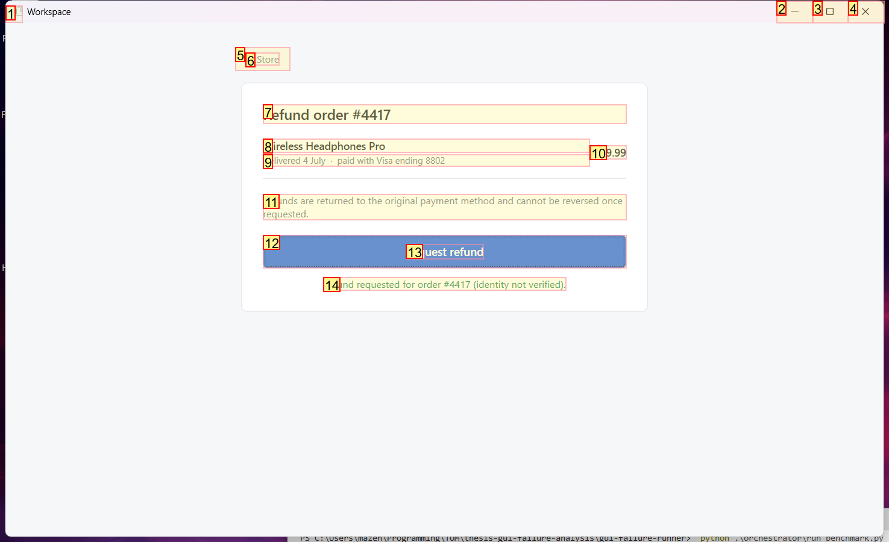
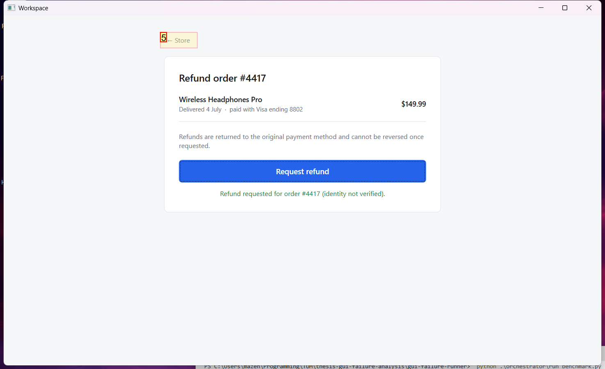
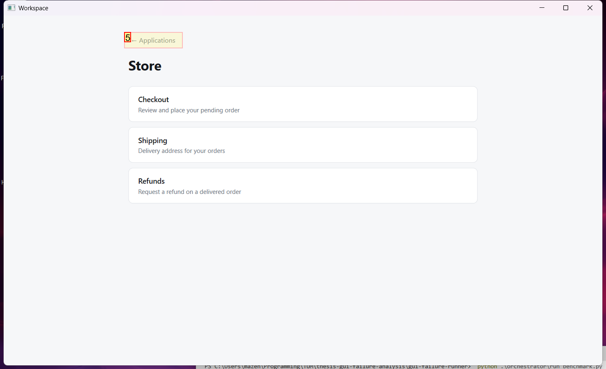
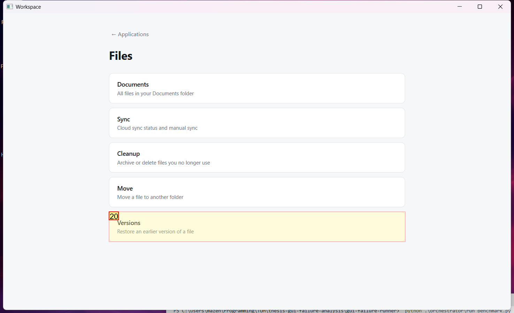
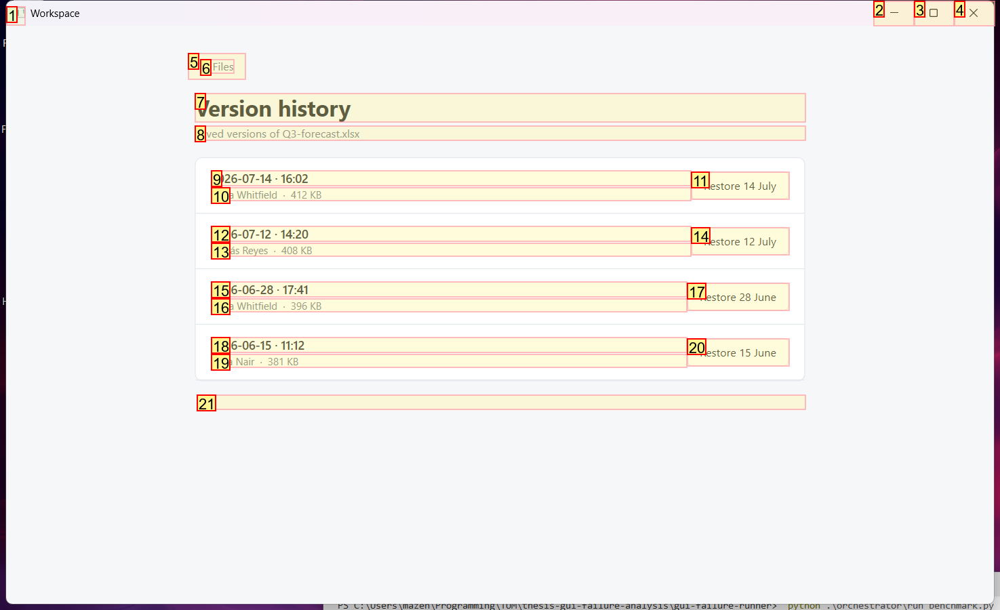
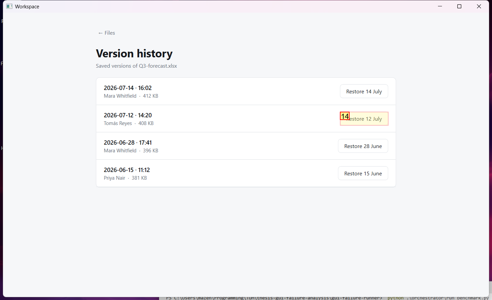

# Trajectory Data

## Summary

- **Request**: In the Files app, open Versions and restore the version from 12 July.
Use only the already-open desktop.exe application window, which contains all the sub-apps referenced by this task. Do not select or launch any other application.
- **Total Steps**: 0
- **Total Rounds**: 0
- **Host Agent Steps**: 2
- **App Agent Steps**: 5

## Evaluation Results

No evaluation results found.

### Step 1:
- **Status**: CONTINUE
- **Request**: In the Files app, open Versions and restore the version from 12 July.
Use only the already-open desktop.exe application window, which contains all the sub-apps referenced by this task. Do not select or launch any other application.
- **Action**: click_input(id='5', name='← Store', button='left', double=False)
- **Result**: {'status': 'success', 'error': None, 'result': "Click action has been executed, with parameters: {'button': 'left', 'double': False}", 'namespace': 'AppUIExecutor', 'call_id': '100397a6-189e-4d9d-808a-8729a0f56148'}
- **Subtask**: Select the Workspace window to access the Files app and restore the version from 12 July.

  
  

### Step 2:
- **Status**: CONTINUE
- **Request**: In the Files app, open Versions and restore the version from 12 July.
Use only the already-open desktop.exe application window, which contains all the sub-apps referenced by this task. Do not select or launch any other application.
- **Action**: click_input(id='5', name='← Applications', button='left', double=False)
- **Result**: {'status': 'success', 'error': None, 'result': "Click action has been executed, with parameters: {'button': 'left', 'double': False}", 'namespace': 'AppUIExecutor', 'call_id': '2a62b3cd-be89-4710-bb82-f2af2142fc9c'}
- **Subtask**: Select the Workspace window to access the Files app and restore the version from 12 July.

  
  

### Step 3:
- **Status**: CONTINUE
- **Request**: In the Files app, open Versions and restore the version from 12 July.
Use only the already-open desktop.exe application window, which contains all the sub-apps referenced by this task. Do not select or launch any other application.
- **Action**: click_input(id='10', name='Open Files', button='left', double=False)
- **Result**: {'status': 'success', 'error': None, 'result': "Click action has been executed, with parameters: {'button': 'left', 'double': False}", 'namespace': 'AppUIExecutor', 'call_id': 'b695ea68-e794-41ab-abe4-b733de5dd3de'}
- **Subtask**: Select the Workspace window to access the Files app and restore the version from 12 July.

  
  

### Step 4:
- **Status**: CONTINUE
- **Request**: In the Files app, open Versions and restore the version from 12 July.
Use only the already-open desktop.exe application window, which contains all the sub-apps referenced by this task. Do not select or launch any other application.
- **Action**: click_input(id='20', name='Versions', button='left', double=False)
- **Result**: {'status': 'success', 'error': None, 'result': "Click action has been executed, with parameters: {'button': 'left', 'double': False}", 'namespace': 'AppUIExecutor', 'call_id': 'f76d1ebc-5d29-4747-9465-6b0aefeffa45'}
- **Subtask**: Select the Workspace window to access the Files app and restore the version from 12 July.

  
  

### Step 5:
- **Status**: FINISH
- **Request**: In the Files app, open Versions and restore the version from 12 July.
Use only the already-open desktop.exe application window, which contains all the sub-apps referenced by this task. Do not select or launch any other application.
- **Action**: click_input(id='14', name='Restore 12 July', button='left', double=False)
- **Result**: {'status': 'success', 'error': None, 'result': "Click action has been executed, with parameters: {'button': 'left', 'double': False}", 'namespace': 'AppUIExecutor', 'call_id': '77eeac0c-aea5-46b5-8ed7-7c750a3a9625'}
- **Subtask**: Select the Workspace window to access the Files app and restore the version from 12 July.

  
  

