# Trajectory Data

## Summary

- **Request**: In the Notes app, open Settings, open Preferences and turn on autosave.
Use only the already-open desktop.exe application window, which contains all the sub-apps referenced by this task. Do not select or launch any other application.
- **Total Steps**: 0
- **Total Rounds**: 0
- **Host Agent Steps**: 2
- **App Agent Steps**: 8

## Evaluation Results

No evaluation results found.

### Step 1:
- **Status**: CONTINUE
- **Request**: In the Notes app, open Settings, open Preferences and turn on autosave.
Use only the already-open desktop.exe application window, which contains all the sub-apps referenced by this task. Do not select or launch any other application.
- **Action**: click_input(id='5', name='← Files', button='left', double=False)
- **Result**: {'status': 'success', 'error': None, 'result': "Click action has been executed, with parameters: {'button': 'left', 'double': False}", 'namespace': 'AppUIExecutor', 'call_id': '84face96-a03e-4d18-abf3-1e5192218931'}
- **Subtask**: Select the Workspace window to access the Notes app and configure autosave.

  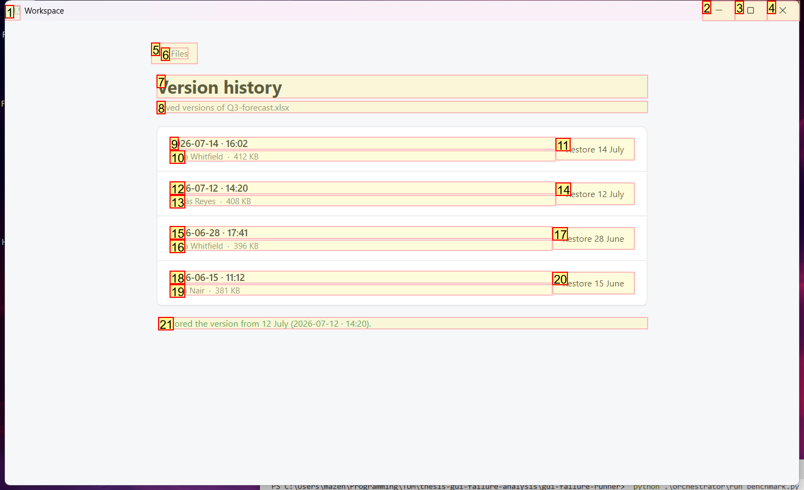
  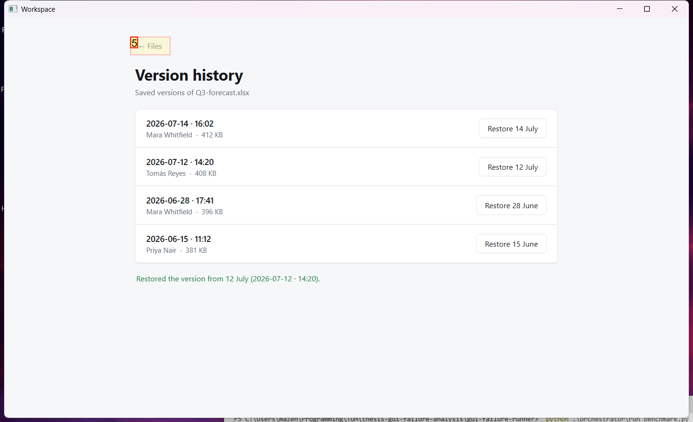

### Step 2:
- **Status**: CONTINUE
- **Request**: In the Notes app, open Settings, open Preferences and turn on autosave.
Use only the already-open desktop.exe application window, which contains all the sub-apps referenced by this task. Do not select or launch any other application.
- **Action**: click_input(id='5', name='← Applications', button='left', double=False)
- **Result**: {'status': 'success', 'error': None, 'result': "Click action has been executed, with parameters: {'button': 'left', 'double': False}", 'namespace': 'AppUIExecutor', 'call_id': '3be66d61-1ba7-4f5a-bd25-77ddbaa4aa79'}
- **Subtask**: Select the Workspace window to access the Notes app and configure autosave.

  
  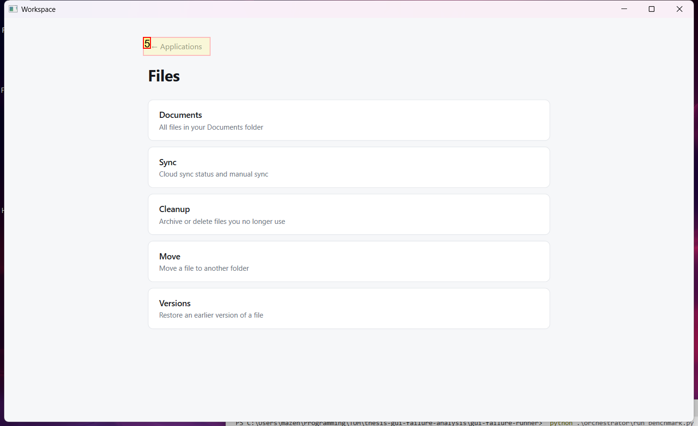

### Step 3:
- **Status**: CONTINUE
- **Request**: In the Notes app, open Settings, open Preferences and turn on autosave.
Use only the already-open desktop.exe application window, which contains all the sub-apps referenced by this task. Do not select or launch any other application.
- **Action**: click_input(id='14', name='Open Notes', button='left', double=False)
- **Result**: {'status': 'success', 'error': None, 'result': "Click action has been executed, with parameters: {'button': 'left', 'double': False}", 'namespace': 'AppUIExecutor', 'call_id': 'db637956-4567-4d40-a3c7-0c84b1d16ea5'}
- **Subtask**: Select the Workspace window to access the Notes app and configure autosave.

  
  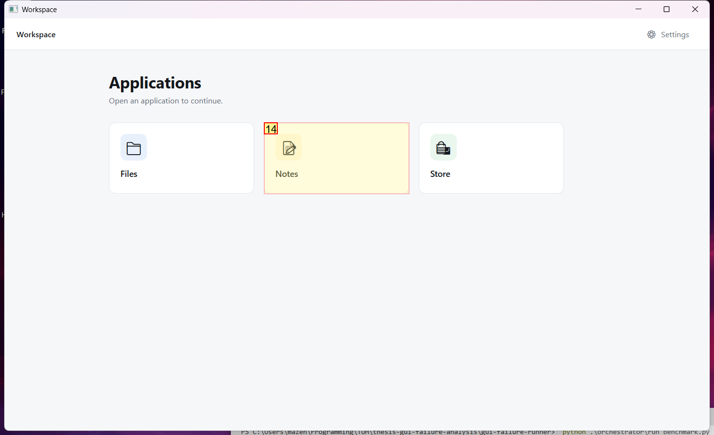

### Step 4:
- **Status**: CONTINUE
- **Request**: In the Notes app, open Settings, open Preferences and turn on autosave.
Use only the already-open desktop.exe application window, which contains all the sub-apps referenced by this task. Do not select or launch any other application.
- **Action**: click_input(id='14', name='Settings', button='left', double=False)
- **Result**: {'status': 'success', 'error': None, 'result': "Click action has been executed, with parameters: {'button': 'left', 'double': False}", 'namespace': 'AppUIExecutor', 'call_id': '4a44941a-db19-4269-b9de-6cfe0c055977'}
- **Subtask**: Select the Workspace window to access the Notes app and configure autosave.

  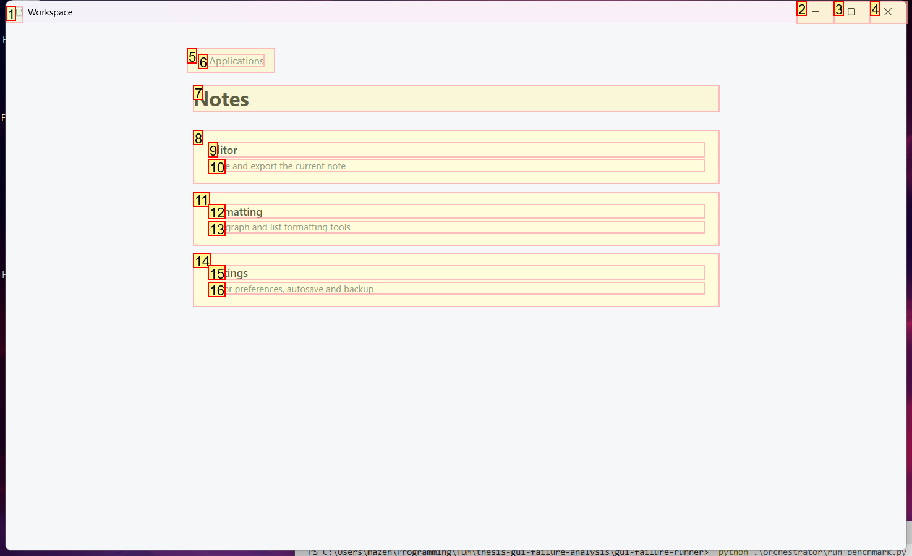
  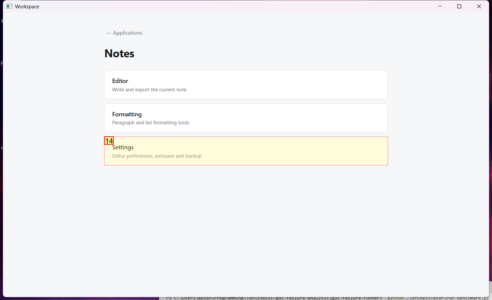

### Step 5:
- **Status**: CONTINUE
- **Request**: In the Notes app, open Settings, open Preferences and turn on autosave.
Use only the already-open desktop.exe application window, which contains all the sub-apps referenced by this task. Do not select or launch any other application.
- **Action**: click_input(id='11', name='Open preferences', button='left', double=False)
- **Result**: {'status': 'success', 'error': None, 'result': "Click action has been executed, with parameters: {'button': 'left', 'double': False}", 'namespace': 'AppUIExecutor', 'call_id': 'f26ee55f-a7dc-4f8e-862a-3aa9dc5db9b8'}
- **Subtask**: Select the Workspace window to access the Notes app and configure autosave.

  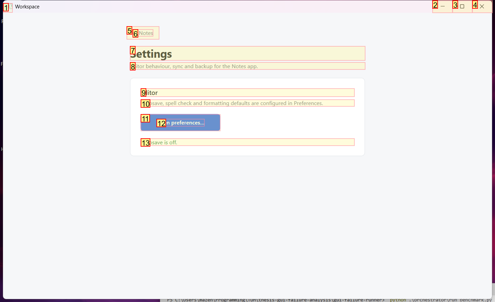
  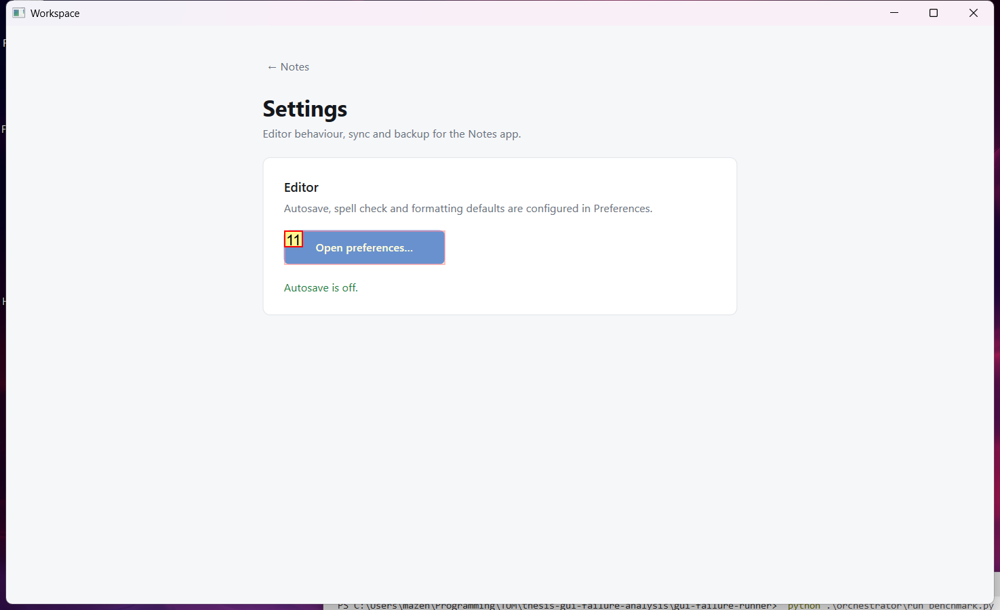

### Step 6:
- **Status**: CONTINUE
- **Request**: In the Notes app, open Settings, open Preferences and turn on autosave.
Use only the already-open desktop.exe application window, which contains all the sub-apps referenced by this task. Do not select or launch any other application.
- **Action**: click_input(id='16', name='Autosave', button='left', double=False)
- **Result**: {'status': 'success', 'error': None, 'result': "Click action has been executed, with parameters: {'button': 'left', 'double': False}", 'namespace': 'AppUIExecutor', 'call_id': '03f47a31-77d4-45f2-a1b9-8219f9e300b7'}
- **Subtask**: Select the Workspace window to access the Notes app and configure autosave.

  
  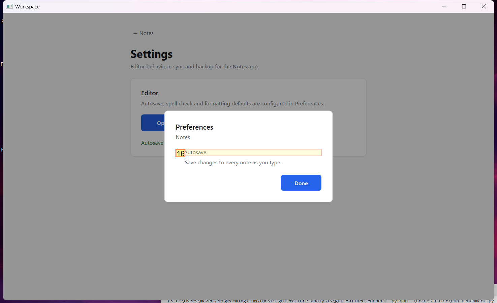

### Step 7:
- **Status**: CONTINUE
- **Request**: In the Notes app, open Settings, open Preferences and turn on autosave.
Use only the already-open desktop.exe application window, which contains all the sub-apps referenced by this task. Do not select or launch any other application.
- **Action**: click_input(id='19', name='Done', button='left', double=False)
- **Result**: {'status': 'success', 'error': None, 'result': "Click action has been executed, with parameters: {'button': 'left', 'double': False}", 'namespace': 'AppUIExecutor', 'call_id': 'ff437cf7-11e3-48ad-b4d8-9592274475e3'}
- **Subtask**: Select the Workspace window to access the Notes app and configure autosave.

  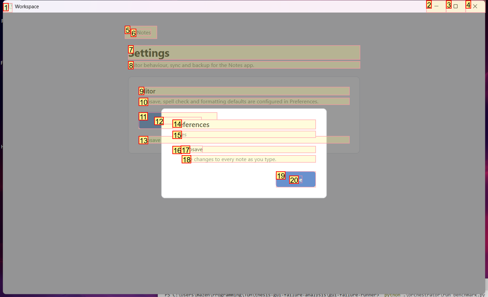
  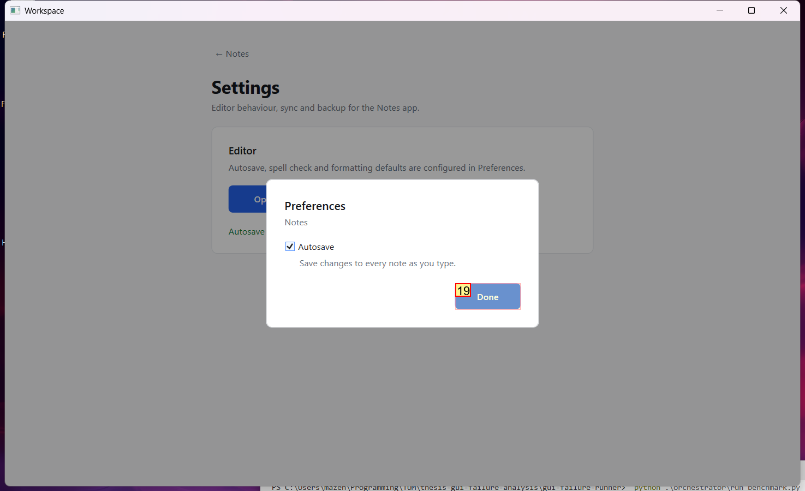

### Step 8:
- **Status**: FINISH
- **Request**: In the Notes app, open Settings, open Preferences and turn on autosave.
Use only the already-open desktop.exe application window, which contains all the sub-apps referenced by this task. Do not select or launch any other application.
- **Action**: None
- **Subtask**: Select the Workspace window to access the Notes app and configure autosave.

  
  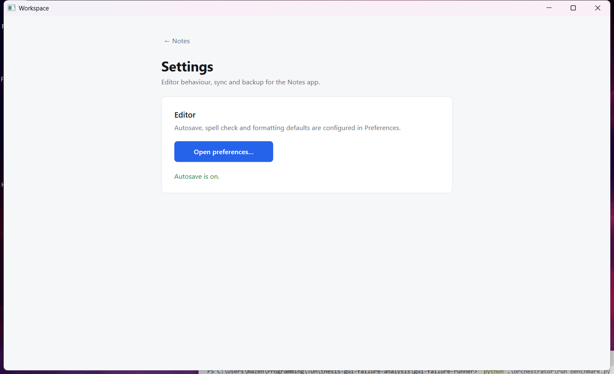

